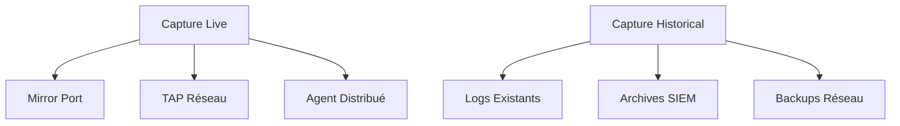

# 🔧 Méthodologie d'Analyse de Trafic Réseau

## 🎯 Introduction

Cette méthodologie définit l'approche structurée pour l'analyse de trafic réseau dans un contexte professionnel de cybersécurité. Elle s'applique aux investigations d'incidents, audits de sécurité, et analyses forensiques.

## 📋 Phases d'Analyse

### Phase 1 : Préparation et Planification

#### 1.1 Définition des Objectifs
- **Objectif principal** : Que cherche-t-on à découvrir ?
- **Scope temporel** : Période d'analyse (incident, audit périodique)
- **Scope technique** : Réseaux, applications, protocoles concernés
- **Contraintes légales** : Autorisations, conformité RGPD

#### 1.2 Collecte d'Informations Préalables
- **Architecture réseau** : Topologie, segments, équipements
- **Baseline normale** : Trafic habituel, patterns connus
- **Contexte d'incident** : Alertes, logs corrélés, témoignages
- **Indicateurs préliminaires** : IoC connus, signatures d'attaque

#### 1.3 Préparation Technique
```bash
# Checklist de préparation
- [ ] Espace disque suffisant (2-5x taille captures)
- [ ] Outils installés et configurés
- [ ] Profils Wireshark adaptés au contexte
- [ ] Scripts d'analyse préparés
- [ ] Environnement isolé pour analyse
```

### Phase 2 : Collecte de Données

#### 2.1 Stratégies de Capture


#### 2.2 Points de Collecte Optimaux
- **Périmètre** : Routeurs de bordure, pare-feu
- **Core Network** : Switches principaux, liens inter-VLAN
- **Segments critiques** : DMZ, serveurs sensibles
- **Endpoints** : Postes de travail, serveurs cibles

#### 2.3 Configuration de Capture
```bash
# Capture optimisée pour l'analyse
tshark -i eth0 \
       -f "not arp and not broadcast" \
       -a filesize:100000 \
       -a files:10 \
       -w capture_%Y%m%d_%H%M%S.pcap
```

### Phase 3 : Analyse Initiale (Triage)

#### 3.1 Vue d'Ensemble
```bash
# Statistiques générales
capinfos *.pcap

# Distribution des protocoles
tshark -r capture.pcap -q -z prot,colinfo

# Top conversations
tshark -r capture.pcap -q -z conv,ip
```

#### 3.2 Identification des Éléments d'Intérêt
- **Volume anormal** : Pics de trafic, transferts massifs
- **Protocoles inhabituels** : Tunneling, protocoles rares
- **Destinations suspectes** : IP externes, géolocalisation
- **Patterns temporels** : Activité hors heures, périodicité

#### 3.3 Priorisation des Investigations
```python
# Score de priorité basé sur les critiques
def calculate_priority_score(conversation):
    score = 0
    
    # Volume de données
    if conversation['bytes'] > 100_000_000:  # >100MB
        score += 3
    
    # IP externes
    if not is_private_ip(conversation['dst_ip']):
        score += 2
    
    # Protocoles à risque
    if conversation['protocol'] in ['DNS', 'ICMP', 'HTTP']:
        score += 1
    
    # Horaires suspects
    if is_off_hours(conversation['time']):
        score += 1
    
    return score
```

### Phase 4 : Investigation Approfondie

#### 4.1 Analyse par Protocole

##### HTTP/HTTPS
```bash
# Extraction des requêtes HTTP
tshark -r capture.pcap -Y "http.request" -T fields \
       -e frame.time -e ip.src -e http.host -e http.request.uri

# Recherche de patterns malveillants
tshark -r capture.pcap -Y "http.request.uri contains \"../\"" 
tshark -r capture.pcap -Y "http.request.uri contains \"script\""
```

##### DNS
```bash
# Requêtes DNS suspectes
tshark -r capture.pcap -Y "dns.qry_name" -T fields \
       -e frame.time -e ip.src -e dns.qry_name

# Détection de tunneling DNS
tshark -r capture.pcap -Y "dns and frame.len > 512"
```

##### TCP Sessions
```bash
# Analyse des sessions TCP longues
tshark -r capture.pcap -q -z conv,tcp

# Sessions avec beaucoup de données
tshark -r capture.pcap -Y "tcp.stream eq X" -z follow,tcp,ascii,X
```

#### 4.2 Détection d'Anomalies

##### Scans de Ports
```python
def detect_port_scan(packets):
    """Détection de scans de ports"""
    syn_packets = {}
    
    for packet in packets:
        if packet.tcp.flags == '0x02':  # SYN
            src = packet.ip.src
            dst_port = packet.tcp.dstport
            
            if src not in syn_packets:
                syn_packets[src] = set()
            syn_packets[src].add(dst_port)
    
    # Détection : plus de 20 ports différents en moins de 60s
    for src, ports in syn_packets.items():
        if len(ports) > 20:
            return f"Port scan detected from {src} - {len(ports)} ports"
```

##### Exfiltration de Données
```bash
# Connexions sortantes volumineuses
tshark -r capture.pcap -Y "tcp.len > 1000" -T fields \
       -e frame.time -e ip.src -e ip.dst -e tcp.len

# Transferts périodiques (beacon)
tshark -r capture.pcap -Y "tcp.stream eq X" -T fields \
       -e frame.time_relative -e tcp.len
```

#### 4.3 Reconstruction d'Attaques

##### Timeline des Événements
```python
class AttackTimeline:
    def __init__(self):
        self.events = []
    
    def add_event(self, timestamp, event_type, details):
        self.events.append({
            'time': timestamp,
            'type': event_type,
            'details': details
        })
    
    def generate_timeline(self):
        """Génère une timeline chronologique"""
        sorted_events = sorted(self.events, key=lambda x: x['time'])
        
        for event in sorted_events:
            print(f"{event['time']} - {event['type']}: {event['details']}")
```

##### Corrélation Multi-Sources
```bash
# Corrélation avec logs système
# Format: timestamp, src_ip, dst_ip, action
grep "$(date -d '@timestamp' '+%Y-%m-%d %H:%M')" /var/log/auth.log

# Corrélation avec SIEM
# Recherche d'alertes dans la fenêtre temporelle
```

### Phase 5 : Validation et Documentation

#### 5.1 Validation des Hypothèses
- **Tests reproductibles** : Vérification avec d'autres captures
- **Corrélation externe** : Threat Intelligence, VirusTotal
- **Validation technique** : Tests en laboratoire

#### 5.2 Quantification de l'Impact
```python
def assess_impact(findings):
    """Évaluation de l'impact d'un incident"""
    impact_score = 0
    
    # Volume de données compromises
    if findings['data_exfiltrated'] > 1_000_000:  # >1GB
        impact_score += 3
    
    # Nombre de systèmes affectés
    impact_score += min(findings['affected_systems'] // 10, 3)
    
    # Durée de l'incident
    if findings['duration_hours'] > 24:
        impact_score += 2
    
    # Classification : 1-3 (Faible), 4-6 (Moyen), 7-9 (Élevé), 10+ (Critique)
    return min(impact_score, 10)
```

#### 5.3 Recommandations Actionables
- **Immédiates** : Isolation, patch, reset credentials
- **Court terme** : Règles firewall, signatures IDS
- **Long terme** : Architecture, formation, processus

## 📊 Templates d'Analyse

### Template Investigation Malware
```bash
#!/bin/bash
# Template d'analyse pour communication malware

PCAP_FILE=$1
MALWARE_IP=$2

echo "🦠 Analyse de communication malware"

# 1. Identification des flux
tshark -r $PCAP_FILE -Y "ip.addr == $MALWARE_IP" -q -z conv,ip

# 2. Extraction des payloads
tshark -r $PCAP_FILE -Y "ip.addr == $MALWARE_IP and tcp.len > 0" \
       -T fields -e tcp.payload > payloads.txt

# 3. Recherche de patterns C2
tshark -r $PCAP_FILE -Y "ip.addr == $MALWARE_IP and http" \
       -T fields -e http.user_agent -e http.host

# 4. Timeline des communications
tshark -r $PCAP_FILE -Y "ip.addr == $MALWARE_IP" \
       -T fields -e frame.time -e ip.src -e ip.dst -e tcp.dstport
```

### Template Investigation Web Attack
```bash
#!/bin/bash
# Template pour attaques web

PCAP_FILE=$1
WEB_SERVER=$2

echo "🌐 Analyse d'attaque web"

# 1. Requêtes malveillantes
tshark -r $PCAP_FILE -Y "ip.dst == $WEB_SERVER and http.request" \
       -T fields -e frame.time -e ip.src -e http.request.uri | \
       grep -E "(script|union|select|\.\.\/|exec)"

# 2. Réponses d'erreur
tshark -r $PCAP_FILE -Y "ip.src == $WEB_SERVER and http.response.code >= 400"

# 3. Upload de fichiers
tshark -r $PCAP_FILE -Y "ip.dst == $WEB_SERVER and http.content_type contains \"multipart\""

# 4. Sessions utilisateurs
tshark -r $PCAP_FILE -Y "ip.dst == $WEB_SERVER and http" \
       -T fields -e ip.src -e http.cookie | sort | uniq -c
```

## 🔍 Indicateurs Techniques

### Signatures d'Attaques Communes

#### Reconnaissance Network
```
# ICMP Sweep
icmp.type == 8 and frame.time_delta < 0.1

# TCP SYN Scan
tcp.flags == 0x02 and tcp.window_size <= 1024

# UDP Scan
udp and icmp.type == 3 and icmp.code == 3
```

#### Web Attacks
```
# SQL Injection
http.request.uri contains "union" or http.request.uri contains "select"

# XSS Attempts
http.request.uri contains "script" or http.request.uri contains "alert"

# Directory Traversal
http.request.uri contains "../" or http.request.uri contains "%2e%2e"
```

#### Malware Communication
```
# Beacon Traffic (régularité suspecte)
tcp.stream eq X and frame.time_delta > 59 and frame.time_delta < 61

# Encoded Payloads
tcp.payload contains "base64" or tcp.payload matches "[A-Za-z0-9+/]{20,}"

# Non-standard User Agents
http.user_agent contains "Python" or http.user_agent contains "curl"
```

## 📈 Métriques de Performance

### KPI d'Analyse
- **Temps de détection** : Délai entre incident et identification
- **Précision** : Ratio vrais positifs / total détections
- **Couverture** : Pourcentage du trafic analysé
- **Temps de résolution** : Délai complet d'investigation

### Optimisation Continue
- **Feedback loop** : Amélioration des signatures
- **Automation** : Scripts pour tâches répétitives
- **Formation** : Montée en compétence équipe
- **Outils** : Évaluation et adoption nouvelles technologies

---

*Cette méthodologie doit être adaptée selon le contexte spécifique de chaque organisation et type d'incident. Elle constitue un framework de base pour structurer l'approche d'analyse de trafic réseau.*