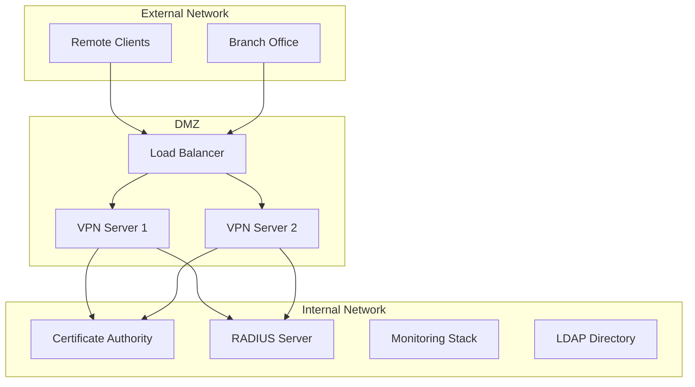

# 🔐 Project 05: Enterprise VPN Management System

## 📋 Project Overview

**Objective**: Develop a comprehensive enterprise-grade VPN management solution supporting both OpenVPN and IPSec (StrongSwan) protocols with automated deployment, certificate management, monitoring, and compliance features.

**Duration**: 4-6 weeks  
**Complexity**: Advanced  
**Technologies**: OpenVPN, StrongSwan (IPSec), Ansible, Docker, Python, Bash

## 🎯 Learning Objectives

- Master enterprise VPN architectures and protocols
- Implement automated PKI certificate lifecycle management
- Develop Infrastructure as Code (IaC) for VPN deployment
- Configure advanced security hardening and compliance
- Build comprehensive monitoring and alerting systems
- Create production-ready documentation and procedures

## 🏗️ Architecture Overview



## 🛠️ Technical Specifications

### VPN Protocols Support
- **OpenVPN**: 2.5+ with modern crypto (AES-256-GCM, ChaCha20-Poly1305)
- **IPSec**: StrongSwan 5.9+ with IKEv2, EAP-TLS, PSK authentication
- **Protocols**: TCP/UDP for OpenVPN, ESP/AH for IPSec
- **Port Configuration**: Configurable with NAT-T support

### Authentication Methods
- **Certificate-based**: X.509 PKI with automated lifecycle
- **RADIUS Integration**: FreeRADIUS with LDAP backend
- **Multi-factor**: TOTP integration via privacyIDEA
- **EAP Methods**: EAP-TLS, EAP-TTLS, EAP-PEAP

### Supported Platforms
- **Servers**: Ubuntu 20.04/22.04, CentOS 8/RHEL 8+, Debian 11+
- **Clients**: Windows 10/11, macOS, Linux, iOS, Android
- **Deployment**: Bare metal, VMware, Docker, Kubernetes

## 📁 Project Structure

```
05-vpn-management/
├── README.md                      # This file
├── CHANGELOG.md                   # Version history
├── LICENSE                        # MIT License
├── Makefile                       # Build automation
├── docker-compose.yml             # Lab environment
├── Vagrantfile                    # VM provisioning
├── .github/                       # CI/CD workflows
│   └── workflows/
├── docs/                          # Documentation
│   ├── architecture/              # Technical architecture
│   ├── admin/                     # Administrator guides
│   └── user/                      # End-user guides
├── src/                           # Source code
│   ├── openvpn/                   # OpenVPN configurations
│   ├── ipsec/                     # IPSec/StrongSwan configs
│   └── common/                    # Shared utilities
├── scripts/                       # Automation scripts
│   ├── bash/                      # Shell scripts
│   ├── ansible/                   # Ansible playbooks
│   └── terraform/                 # Infrastructure code
├── tests/                         # Testing suites
│   ├── unit/                      # Unit tests
│   ├── integration/               # Integration tests
│   └── security/                  # Security tests
├── configs/                       # Configuration templates
├── tools/                         # Custom utilities
└── examples/                      # Usage examples
```

## 🚀 Quick Start

### Prerequisites
- Docker 20.10+ and Docker Compose
- Ansible 4.0+ with collections
- Python 3.8+ with pip
- Vagrant 2.2+ (optional, for VM testing)

### Lab Environment Setup
```bash
# Clone and navigate to project
cd cybersecurity-portfolio/projects/05-vpn-management

# Start lab environment
make lab-up

# Initialize PKI infrastructure
make pki-init

# Deploy OpenVPN server
make deploy-openvpn

# Deploy IPSec server
make deploy-ipsec

# Generate client certificates
make client-cert NAME=john.doe EMAIL=john@company.com

# Test connections
make test-connectivity
```

### Production Deployment
```bash
# Configure inventory
cp scripts/ansible/inventories/example.yml scripts/ansible/inventories/production.yml

# Edit production inventory
nano scripts/ansible/inventories/production.yml

# Deploy to production
make deploy-production INVENTORY=production
```

## 📊 Key Features

### 🔑 Certificate Management
- **Automated PKI**: Easy-RSA 3.0+ with automated certificate generation
- **Lifecycle Management**: Creation, renewal, revocation, CRL distribution
- **Hardware Security**: Optional HSM integration (YubiHSM2, AWS CloudHSM)
- **Certificate Transparency**: CT log submission for public certificates

### 🛡️ Security Hardening
- **CIS Benchmarks**: Automated application of security baselines
- **Network Segmentation**: IPTables/nftables with least privilege
- **Log Management**: Structured logging with retention policies
- **Vulnerability Scanning**: Integrated OpenVAS and Nessus scanning

### 📈 Monitoring & Alerting
- **Metrics Collection**: Prometheus exporters for VPN metrics
- **Log Aggregation**: ELK stack or Loki for centralized logging
- **Dashboards**: Grafana with custom VPN dashboards
- **Alerting**: AlertManager with Slack/email notifications

### 🔄 High Availability
- **Load Balancing**: HAProxy/nginx for connection distribution
- **Failover**: Automatic failover with health checking
- **Backup/Restore**: Automated backup of configurations and certificates
- **Disaster Recovery**: Complete DR procedures and testing

## 🧪 Testing Strategy

### Unit Tests (PyTest)
- Configuration template rendering
- Certificate generation and validation
- Ansible role testing with Molecule
- Python utility function testing

### Integration Tests
- Docker-based tunnel establishment
- Client connectivity across platforms
- Authentication flow validation
- Network routing verification

### Security Tests
- Vulnerability scanning (OpenVAS, Nmap)
- Configuration security analysis
- Penetration testing automation
- Compliance checking (CIS, NIST)

### Performance Tests
- Connection throughput measurement
- Concurrent connection limits
- Resource usage monitoring
- Stress testing with load generation

## 🚦 CI/CD Pipeline

### GitHub Actions Workflow
1. **Code Quality**: Linting (yamllint, shellcheck, ansible-lint)
2. **Security Scanning**: SAST with Semgrep, dependency check with Trivy
3. **Unit Testing**: PyTest execution with coverage reporting
4. **Integration Testing**: Docker-based connectivity tests
5. **Image Building**: Docker image creation and signing with Cosign
6. **Security Testing**: Container scanning with Trivy
7. **Deployment**: Automated deployment to staging environment
8. **Acceptance Testing**: End-to-end validation
9. **Production Gate**: Manual approval for production deployment

## 📋 Compliance & Standards

### Security Frameworks
- **NIST Cybersecurity Framework**: Implementation mapping
- **CIS Controls**: Automated implementation of relevant controls
- **ISO 27001**: Security management system alignment
- **SOC 2**: Trust services criteria compliance

### VPN Standards
- **RFC 3948**: UDP Encapsulation of IPsec ESP Packets
- **RFC 4301**: Security Architecture for IP
- **RFC 7296**: Internet Key Exchange Protocol Version 2 (IKEv2)
- **RFC 7427**: Signature Authentication in IKEv2

## 📖 Documentation

### Administrator Documentation
- [Installation Guide](docs/admin/installation.md)
- [Configuration Reference](docs/admin/configuration.md)
- [Certificate Management](docs/admin/certificate-management.md)
- [Monitoring Setup](docs/admin/monitoring.md)
- [Troubleshooting Guide](docs/admin/troubleshooting.md)
- [Disaster Recovery](docs/admin/disaster-recovery.md)

### User Documentation
- [Windows Client Setup](docs/user/windows-client.md)
- [macOS Client Setup](docs/user/macos-client.md)
- [Linux Client Setup](docs/user/linux-client.md)
- [Mobile Client Setup](docs/user/mobile-clients.md)

### Architecture Documentation
- [System Architecture](docs/architecture/system-overview.md)
- [Network Design](docs/architecture/network-design.md)
- [Security Model](docs/architecture/security-model.md)
- [Scalability Design](docs/architecture/scalability.md)

## 🎯 Success Criteria

### Technical Metrics
- [ ] **Availability**: 99.9% uptime SLA
- [ ] **Performance**: <100ms connection establishment
- [ ] **Throughput**: 95% of available bandwidth utilization
- [ ] **Security**: Zero critical vulnerabilities
- [ ] **Test Coverage**: >90% code coverage
- [ ] **Automation**: 100% infrastructure as code

### Operational Metrics
- [ ] **MTTR**: <15 minutes mean time to recovery
- [ ] **MTBF**: >720 hours mean time between failures
- [ ] **Certificate Management**: Automated 90% of operations
- [ ] **Monitoring**: 100% service visibility
- [ ] **Documentation**: Complete admin and user guides
- [ ] **Compliance**: Pass all security audits

## 🏆 Learning Outcomes

Upon completion, you will demonstrate:
- **VPN Protocol Mastery**: Deep understanding of OpenVPN and IPSec
- **PKI Expertise**: Complete certificate lifecycle management
- **Infrastructure Automation**: Ansible, Terraform, Docker proficiency
- **Security Hardening**: Enterprise-grade security implementation
- **Monitoring & Observability**: Production monitoring setup
- **DevSecOps Practices**: Security-integrated CI/CD pipelines

## 🤝 Contributing

1. Fork the repository
2. Create a feature branch (`git checkout -b feature/amazing-feature`)
3. Commit your changes (`git commit -m 'Add amazing feature'`)
4. Push to the branch (`git push origin feature/amazing-feature`)
5. Open a Pull Request

## 📄 License

This project is licensed under the MIT License - see the [LICENSE](LICENSE) file for details.

## 🔗 References

- [OpenVPN Community](https://openvpn.net/)
- [StrongSwan Documentation](https://docs.strongswan.org/)
- [Ansible VPN Collection](https://galaxy.ansible.com/community/general)
- [NIST VPN Guidelines](https://csrc.nist.gov/publications/detail/sp/800-113/final)

---

**⚠️ Security Notice**: This project is for educational and testing purposes. Always follow your organization's security policies and conduct thorough security reviews before production deployment.

**📞 Support**: For questions or issues, please open a GitHub issue or contact the project maintainer.

**🏷️ Project Tags**: `vpn`, `openvpn`, `ipsec`, `strongswan`, `cybersecurity`, `networking`, `pki`, `certificate-management`