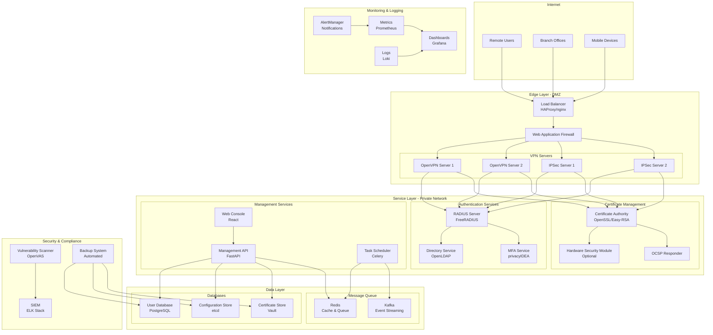

# System Architecture Overview

## 📐 Enterprise VPN Management System Architecture

### Executive Summary

The Enterprise VPN Management System provides a comprehensive, scalable, and secure solution for managing multi-protocol VPN infrastructure. The system supports both OpenVPN and IPSec/StrongSwan protocols with automated certificate management, centralized authentication, comprehensive monitoring, and compliance features.

### Architecture Principles

#### 🎯 Design Goals
- **Security First**: Zero-trust architecture with defense in depth
- **High Availability**: 99.9% uptime with automated failover
- **Scalability**: Horizontal scaling to support 10,000+ concurrent connections
- **Maintainability**: Infrastructure as Code with automated deployments
- **Compliance**: NIST, ISO 27001, SOC 2 compliance built-in
- **Observability**: Complete visibility into system health and security events

#### 🏗️ Architectural Patterns
- **Microservices Architecture**: Loosely coupled, independently deployable services
- **Event-Driven Design**: Asynchronous communication with message queues
- **API-First**: RESTful APIs for all service interactions
- **Infrastructure as Code**: Declarative infrastructure management
- **GitOps**: Version-controlled operations and deployments

---

## 🌐 System Architecture Diagram

---

## 🔧 Component Architecture

### Edge Layer Components

#### Load Balancer (HAProxy/nginx)
- **Purpose**: Traffic distribution and SSL termination
- **Features**: 
  - Layer 4 & 7 load balancing
  - Health checking and failover
  - Rate limiting and DDoS protection
  - SSL/TLS termination
- **High Availability**: Active-passive with VRRP

#### Web Application Firewall (WAF)
- **Purpose**: Application-layer security filtering
- **Features**:
  - OWASP Top 10 protection
  - Custom rule sets
  - Geographic filtering
  - Bot protection
- **Integration**: ModSecurity with custom rules

#### VPN Servers
- **OpenVPN Servers**:
  - Protocol: OpenVPN 2.5+ with UDP/TCP support
  - Encryption: AES-256-GCM, ChaCha20-Poly1305
  - Authentication: Certificate-based with optional 2FA
  - Capacity: 1,000 concurrent connections per server

- **IPSec Servers (StrongSwan)**:
  - Protocol: IKEv2 with ESP encapsulation
  - Encryption: AES-256, ChaCha20
  - Authentication: X.509 certificates, PSK, EAP-TLS
  - Capacity: 500 concurrent tunnels per server

### Service Layer Components

#### Authentication Services
- **RADIUS Server (FreeRADIUS)**:
  - Protocol: RADIUS with EAP extensions
  - Integration: LDAP, SQL, REST APIs
  - Features: Accounting, CoA, dynamic VLAN assignment
  - Performance: 10,000+ authentications/second

- **Directory Service (OpenLDAP)**:
  - Schema: Custom VPN user attributes
  - Replication: Multi-master with conflict resolution
  - Integration: RADIUS, web console, API
  - Capacity: 100,000+ user entries

- **MFA Service (privacyIDEA)**:
  - Methods: TOTP, HOTP, SMS, Email, Push notifications
  - Integration: RADIUS, REST API
  - Hardware tokens: YubiKey, RSA SecurID
  - Policy engine: Conditional authentication

#### Certificate Management
- **Certificate Authority (CA)**:
  - Implementation: OpenSSL with Easy-RSA wrapper
  - Hierarchy: Root CA → Intermediate CA → End-entity certificates
  - Key sizes: RSA 2048/4096, ECDSA P-256/P-384
  - Validity periods: Configurable with automatic renewal

- **Hardware Security Module (HSM)**:
  - Options: YubiHSM2, AWS CloudHSM, Azure Key Vault
  - Purpose: Root key protection and high-assurance signing
  - Integration: PKCS#11 interface
  - Compliance: FIPS 140-2 Level 3

- **OCSP Responder**:
  - Real-time certificate status checking
  - Performance: Sub-100ms response times
  - Availability: 99.9% uptime SLA
  - Caching: Intelligent response caching

#### Management Services
- **Management API (FastAPI)**:
  - Architecture: RESTful API with OpenAPI specification
  - Authentication: JWT with RBAC
  - Rate limiting: Per-user and global limits
  - Versioning: Semantic versioning with backward compatibility

- **Web Console (React)**:
  - Framework: React 18 with TypeScript
  - Authentication: OIDC/SAML integration
  - Features: Real-time dashboards, configuration management
  - Security: CSP headers, XSS protection, CSRF tokens

- **Task Scheduler (Celery)**:
  - Queue backend: Redis with persistence
  - Workers: Distributed across multiple nodes
  - Monitoring: Flower for task monitoring
  - Scheduling: Cron-like scheduling with timezone support

### Data Layer Components

#### Databases
- **User Database (PostgreSQL)**:
  - Version: PostgreSQL 14+ with logical replication
  - Schema: Multi-tenant with row-level security
  - Performance: Connection pooling with PgBouncer
  - Backup: Point-in-time recovery with 7-day retention

- **Configuration Store (etcd)**:
  - Version: etcd v3 with clustering
  - Purpose: Distributed configuration management
  - Consistency: Strong consistency with Raft consensus
  - Watch API: Real-time configuration updates

- **Certificate Store (Vault)**:
  - Version: HashiCorp Vault with enterprise features
  - Purpose: Secure certificate and key storage
  - Encryption: AES-256-GCM with seal/unseal operations
  - Audit: Complete audit trail with log forwarding

#### Message Queue
- **Redis**:
  - Version: Redis 7+ with clustering
  - Use cases: Session cache, task queue, pub/sub
  - Persistence: RDB snapshots with AOF logging
  - High availability: Redis Sentinel with automatic failover

- **Kafka**:
  - Version: Apache Kafka 3+ with Kraft mode
  - Use cases: Event streaming, audit logs, metrics
  - Retention: 7-day retention with compression
  - Partitioning: Topic partitioning for scalability

---

## 🔒 Security Architecture

### Defense in Depth Strategy

#### Network Security
1. **Perimeter Defense**:
   - Firewall rules with least privilege
   - DDoS protection and rate limiting
   - Geographic IP filtering
   - VPN server isolation in DMZ

2. **Internal Segmentation**:
   - VLAN segmentation for service tiers
   - Micro-segmentation with network policies
   - East-west traffic inspection
   - Zero-trust network access

3. **Encryption**:
   - TLS 1.3 for all API communications
   - mTLS between internal services
   - End-to-end encryption for VPN tunnels
   - Encryption at rest for databases

#### Application Security
1. **Authentication & Authorization**:
   - Multi-factor authentication (MFA)
   - Role-based access control (RBAC)
   - Attribute-based access control (ABAC)
   - JWT tokens with short expiration

2. **Input Validation**:
   - Schema validation for all APIs
   - SQL injection prevention
   - XSS protection with CSP headers
   - CSRF token validation

3. **Secure Development**:
   - Static application security testing (SAST)
   - Dynamic application security testing (DAST)
   - Dependency vulnerability scanning
   - Code review process

#### Infrastructure Security
1. **Container Security**:
   - Minimal base images with distroless
   - Image vulnerability scanning
   - Runtime security monitoring
   - Pod security policies/standards

2. **Secrets Management**:
   - HashiCorp Vault for secret storage
   - Kubernetes secrets with encryption at rest
   - Automatic secret rotation
   - Audit trail for secret access

3. **Compliance**:
   - CIS benchmarks implementation
   - NIST Cybersecurity Framework mapping
   - ISO 27001 controls implementation
   - SOC 2 Type II compliance

---

## 📊 Monitoring & Observability

### Metrics Collection
- **Infrastructure Metrics**: CPU, memory, disk, network utilization
- **Application Metrics**: Response times, error rates, throughput
- **VPN Metrics**: Connection counts, bandwidth usage, authentication rates
- **Security Metrics**: Failed login attempts, certificate expirations, vulnerability counts

### Logging Strategy
- **Structured Logging**: JSON format with consistent schemas
- **Log Levels**: DEBUG, INFO, WARN, ERROR, CRITICAL
- **Log Retention**: 90 days for security logs, 30 days for application logs
- **Log Forwarding**: Centralized logging with secure transport

### Alerting Framework
- **Alert Levels**: Critical, Warning, Info
- **Notification Channels**: Email, Slack, PagerDuty, SMS
- **Escalation Policies**: Auto-escalation with acknowledgment tracking
- **Alert Correlation**: Intelligent grouping to reduce noise

### Dashboard Design
- **Executive Dashboard**: High-level KPIs and system health
- **Operations Dashboard**: Detailed metrics for operators
- **Security Dashboard**: Security events and threat indicators
- **Capacity Dashboard**: Resource utilization and growth trends

---

## 🚀 Deployment Architecture

### Container Orchestration
- **Platform**: Kubernetes 1.26+ with containerd runtime
- **Distribution**: Production-grade distribution (EKS, AKS, GKE, or on-premises)
- **Networking**: CNI with network policies (Calico, Cilium)
- **Storage**: CSI drivers for persistent volumes

### CI/CD Pipeline
- **Source Control**: Git with GitOps workflow
- **Build System**: GitHub Actions with self-hosted runners
- **Container Registry**: Harbor or cloud-native registries
- **Deployment**: ArgoCD with Helm charts

### Infrastructure as Code
- **Provisioning**: Terraform with state management
- **Configuration**: Ansible playbooks with idempotency
- **Validation**: Terratest for infrastructure testing
- **Compliance**: Policy as code with Open Policy Agent

### Environment Strategy
- **Development**: Single-node Kubernetes with mock services
- **Staging**: Production-like environment with subset data
- **Production**: High-availability cluster with geographic distribution
- **Disaster Recovery**: Secondary site with data replication

---

## 📈 Scalability & Performance

### Horizontal Scaling
- **VPN Servers**: Auto-scaling groups with load balancing
- **API Services**: Kubernetes HPA with custom metrics
- **Database**: Read replicas with connection pooling
- **Cache**: Redis clustering with consistent hashing

### Performance Optimization
- **Caching Strategy**: Multi-layer caching (CDN, application, database)
- **Database Optimization**: Query optimization and indexing
- **Connection Pooling**: Efficient resource utilization
- **Content Delivery**: CDN for static assets

### Capacity Planning
- **Monitoring**: Resource utilization tracking
- **Forecasting**: Predictive analytics for capacity needs
- **Scaling Triggers**: Automated scaling based on metrics
- **Cost Optimization**: Right-sizing and reserved capacity

---

## 🔄 High Availability & Disaster Recovery

### High Availability Design
- **RTO (Recovery Time Objective)**: < 15 minutes
- **RPO (Recovery Point Objective)**: < 1 hour
- **Availability Target**: 99.9% uptime (8.77 hours downtime/year)
- **Geographic Distribution**: Multi-region deployment

### Disaster Recovery Strategy
- **Backup Strategy**: Automated daily backups with retention policies
- **Data Replication**: Synchronous and asynchronous replication
- **Failover Process**: Automated failover with manual override
- **Recovery Testing**: Monthly DR testing with documented procedures

### Business Continuity
- **Communication Plan**: Stakeholder notification procedures
- **Service Prioritization**: Critical vs. non-critical services
- **Alternative Procedures**: Manual processes during outages
- **Vendor Dependencies**: Multi-vendor strategy to avoid single points of failure

---

## 📋 Compliance & Governance

### Regulatory Compliance
- **NIST Cybersecurity Framework**: Comprehensive implementation
- **ISO 27001**: Information security management system
- **SOC 2 Type II**: Security and availability controls
- **GDPR**: Data protection and privacy controls

### Governance Framework
- **Change Management**: Formal change approval process
- **Risk Management**: Regular risk assessments and mitigation
- **Incident Response**: Documented incident response procedures
- **Audit Trail**: Complete audit logging and retention

### Security Policies
- **Access Control Policy**: User provisioning and deprovisioning
- **Data Classification Policy**: Sensitive data handling
- **Encryption Policy**: Encryption standards and key management
- **Vulnerability Management Policy**: Patching and remediation procedures

---

This architecture documentation provides a comprehensive overview of the Enterprise VPN Management System design. For detailed implementation guides, refer to the specific component documentation in the respective subdirectories.