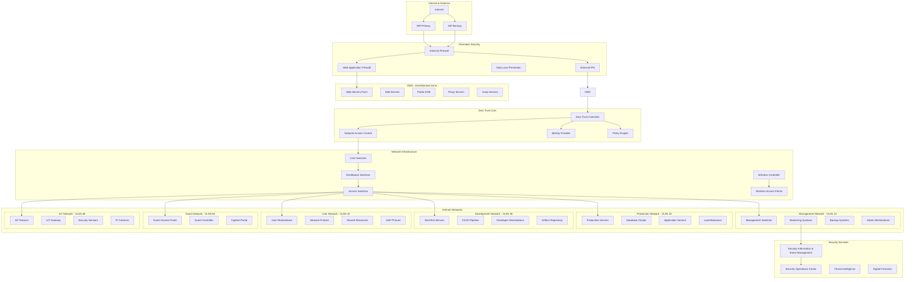

# 🛡️ Project 06: Secure Network Design & Zero Trust Architecture

## 📋 Project Overview

**Objective**: Design and implement a comprehensive enterprise-grade secure network architecture based on Zero Trust principles, featuring advanced segmentation, micro-segmentation, network access control, and automated security policies.

**Duration**: 5-7 weeks  
**Complexity**: Advanced  
**Technologies**: VLAN, Zero Trust, NAC, Cisco/Juniper, pfSense, GNS3, Ansible, Terraform

## 🎯 Learning Objectives

- Master Zero Trust network architecture principles and implementation
- Design enterprise network segmentation with VLANs and micro-segmentation
- Implement Network Access Control (NAC) and device authentication
- Deploy automated network security controls and policy enforcement
- Build comprehensive network monitoring and visibility solutions
- Create compliance-ready network documentation and audit trails

## 🏗️ Architecture Overview



## 🛠️ Technical Specifications

### Network Segmentation Architecture
- **Core Layer**: High-performance switching with redundancy (40Gbps+ links)
- **Distribution Layer**: Policy enforcement and VLAN routing
- **Access Layer**: End-device connectivity with port security
- **Zero Trust Enforcement**: Software-defined perimeter with micro-segmentation

### VLAN Segmentation Strategy
```
Management VLAN (10):     172.16.10.0/24    - Network management and monitoring
Production VLAN (20):     172.16.20.0/24    - Production servers and services
Development VLAN (30):    172.16.30.0/24    - Development and testing
User VLAN (40):           172.16.40.0/24    - Employee workstations
Guest VLAN (50):          172.16.50.0/24    - Guest and visitor access
IoT VLAN (60):            172.16.60.0/24    - IoT devices and sensors
DMZ VLAN (70):            172.16.70.0/24    - Public-facing services
Security VLAN (80):       172.16.80.0/24    - Security tools and appliances
```

### Zero Trust Implementation
- **Identity Verification**: Multi-factor authentication for all access
- **Device Trust**: Device compliance and health verification
- **Least Privilege**: Minimal access rights with just-in-time elevation
- **Micro-segmentation**: Application-level traffic isolation
- **Continuous Monitoring**: Real-time behavior analysis and anomaly detection

## 📁 Project Structure

```
06-secure-network-design/
├── README.md                          # This file
├── CHANGELOG.md                       # Version history
├── LICENSE                           # MIT License
├── Makefile                          # Build and deployment automation
├── docker-compose.yml                # Lab environment
├── .env.template                     # Environment configuration
├── docs/                             # Documentation
│   ├── architecture/                 # Network architecture designs
│   │   ├── network-topology.md      # Complete network topology
│   │   ├── zero-trust-design.md     # Zero trust architecture
│   │   ├── segmentation-strategy.md # Network segmentation approach
│   │   └── security-controls.md     # Security control implementation
│   ├── design/                      # Design specifications
│   │   ├── vlan-design.md           # VLAN design and assignments
│   │   ├── routing-design.md        # Inter-VLAN routing design
│   │   ├── security-policies.md     # Network security policies
│   │   └── qos-design.md            # Quality of Service design
│   ├── implementation/              # Implementation guides
│   │   ├── deployment-guide.md      # Step-by-step deployment
│   │   ├── configuration-guide.md   # Device configuration procedures
│   │   ├── testing-procedures.md    # Network testing methodologies
│   │   └── troubleshooting.md       # Troubleshooting procedures
│   └── compliance/                  # Compliance documentation
│       ├── nist-mapping.md          # NIST framework mapping
│       ├── iso-27001-controls.md    # ISO 27001 compliance
│       ├── pci-dss-requirements.md  # PCI-DSS network requirements
│       └── audit-procedures.md      # Network audit procedures
├── src/                             # Source configurations
│   ├── configurations/              # Device configurations
│   │   ├── cisco/                   # Cisco device configs
│   │   ├── juniper/                 # Juniper device configs
│   │   ├── pfsense/                 # pfSense configurations
│   │   └── linux/                   # Linux network configurations
│   ├── templates/                   # Configuration templates
│   │   ├── switch-template.j2       # Switch configuration template
│   │   ├── router-template.j2       # Router configuration template
│   │   ├── firewall-template.j2     # Firewall configuration template
│   │   └── wireless-template.j2     # Wireless configuration template
│   └── policies/                    # Security policies
│       ├── access-control-lists.conf # ACL configurations
│       ├── firewall-rules.conf      # Firewall rule sets
│       ├── qos-policies.conf        # QoS policy configurations
│       └── security-zones.conf      # Security zone definitions
├── scripts/                         # Automation scripts
│   ├── automation/                  # Network automation
│   │   ├── device-provisioning.py   # Automated device setup
│   │   ├── config-backup.py         # Configuration backup
│   │   ├── compliance-check.py      # Compliance validation
│   │   └── network-discovery.py     # Network topology discovery
│   ├── deployment/                  # Deployment scripts
│   │   ├── deploy-network.sh        # Complete network deployment
│   │   ├── configure-vlans.sh       # VLAN configuration
│   │   ├── setup-monitoring.sh      # Monitoring setup
│   │   └── security-hardening.sh    # Security hardening
│   └── testing/                     # Testing scripts
│       ├── connectivity-test.py     # Network connectivity testing
│       ├── security-test.py         # Security validation testing
│       ├── performance-test.py      # Network performance testing
│       └── compliance-test.py       # Compliance testing
├── tests/                           # Testing suites
│   ├── validation/                  # Network validation tests
│   │   ├── test_connectivity.py     # Connectivity validation
│   │   ├── test_segmentation.py     # Segmentation validation
│   │   ├── test_policies.py         # Policy enforcement testing
│   │   └── test_redundancy.py       # Redundancy and failover testing
│   ├── compliance/                  # Compliance tests
│   │   ├── test_nist_controls.py    # NIST compliance testing
│   │   ├── test_iso27001.py         # ISO 27001 compliance
│   │   ├── test_pci_dss.py          # PCI-DSS compliance
│   │   └── test_audit_trail.py      # Audit trail validation
│   └── penetration/                 # Penetration testing
│       ├── test_lateral_movement.py # Lateral movement testing
│       ├── test_privilege_esc.py    # Privilege escalation testing
│       ├── test_data_exfil.py       # Data exfiltration testing
│       └── test_dos_attacks.py      # Denial of service testing
├── infrastructure/                  # Infrastructure as Code
│   ├── terraform/                   # Terraform configurations
│   │   ├── aws/                     # AWS network infrastructure
│   │   ├── azure/                   # Azure network infrastructure
│   │   ├── gcp/                     # Google Cloud network infrastructure
│   │   └── on-premises/             # On-premises infrastructure
│   ├── ansible/                     # Ansible playbooks
│   │   ├── playbooks/               # Network configuration playbooks
│   │   ├── roles/                   # Ansible roles for network devices
│   │   ├── inventories/             # Network device inventories
│   │   └── group_vars/              # Group variable configurations
│   └── monitoring/                  # Monitoring configurations
│       ├── prometheus/              # Prometheus monitoring
│       ├── grafana/                 # Grafana dashboards
│       ├── elk/                     # ELK stack configuration
│       └── netbox/                  # NetBox IPAM configuration
├── tools/                           # Custom tools and utilities
│   ├── network-scanner/             # Custom network scanning tool
│   ├── config-diff/                 # Configuration difference analyzer
│   ├── security-audit/              # Network security audit tool
│   └── topology-mapper/             # Network topology mapping tool
└── examples/                        # Usage examples
    ├── lab-scenarios/               # Lab deployment scenarios
    ├── enterprise-configs/          # Enterprise configuration examples
    ├── security-policies/           # Security policy examples
    └── monitoring-dashboards/       # Monitoring dashboard examples
```

## 🚀 Quick Start

### Prerequisites
- **GNS3/EVE-NG**: Network simulation environment
- **Docker**: 20.10+ for containerized services
- **Python**: 3.8+ with network libraries (netmiko, napalm, paramiko)
- **Ansible**: 4.0+ with network collections
- **Terraform**: 1.3+ for infrastructure provisioning

### Lab Environment Setup
```bash
# Clone and navigate to project
cd projects/06-secure-network-design

# Install dependencies
make install

# Start network simulation lab
make lab-start

# Deploy base network configuration
make deploy-base-network

# Configure VLANs and segmentation
make configure-segmentation

# Implement Zero Trust controls
make deploy-zero-trust

# Start monitoring and validation
make start-monitoring
make validate-network
```

### Production Deployment
```bash
# Prepare production environment
make prepare-production

# Deploy network infrastructure
make deploy-production ENVIRONMENT=prod

# Configure security policies
make configure-security-policies

# Validate compliance
make compliance-check

# Start monitoring
make start-production-monitoring
```

## 📊 Key Features

### 🔐 Zero Trust Architecture
- **Never Trust, Always Verify**: Continuous authentication and authorization
- **Least Privilege Access**: Minimal access rights with dynamic elevation
- **Assume Breach**: Design assuming network compromise
- **Encryption Everywhere**: End-to-end encryption for all communications
- **Continuous Monitoring**: Real-time behavior analysis and threat detection

### 🛡️ Network Segmentation
- **Macro-Segmentation**: VLAN-based network isolation
- **Micro-Segmentation**: Application-level traffic control
- **Dynamic Segmentation**: Automated policy enforcement
- **Traffic Inspection**: Deep packet inspection at segment boundaries
- **Lateral Movement Prevention**: Restricted inter-segment communication

### 📡 Network Access Control (NAC)
- **Device Authentication**: 802.1X with certificate-based authentication
- **Device Compliance**: Health verification and policy enforcement
- **Dynamic VLAN Assignment**: Automated network placement
- **Quarantine Capability**: Isolation of non-compliant devices
- **Guest Network Management**: Secure temporary access provisioning

### 🔍 Monitoring & Visibility
- **Network Flow Analysis**: Real-time traffic analysis with NetFlow/sFlow
- **Security Event Correlation**: SIEM integration for threat detection
- **Performance Monitoring**: Network performance and capacity monitoring
- **Topology Discovery**: Automated network mapping and documentation
- **Compliance Reporting**: Automated compliance status reporting

### 🤖 Automation & Orchestration
- **Configuration Management**: Automated device configuration with Ansible
- **Policy Deployment**: Automated security policy enforcement
- **Compliance Monitoring**: Continuous compliance validation
- **Incident Response**: Automated threat response and remediation
- **Capacity Management**: Automated capacity planning and scaling

## 🧪 Testing Strategy

### Network Validation Testing
- **Connectivity Testing**: End-to-end connectivity validation
- **Segmentation Testing**: Inter-VLAN communication verification
- **Policy Enforcement**: Security policy compliance testing
- **Performance Testing**: Network performance and capacity testing

### Security Penetration Testing
- **Lateral Movement**: Simulated lateral movement attempts
- **Privilege Escalation**: Elevation of privilege testing
- **Data Exfiltration**: Data loss prevention testing
- **Network Attacks**: Various network-based attack simulations

### Compliance Testing
- **NIST Framework**: Cybersecurity framework compliance validation
- **ISO 27001**: Information security management compliance
- **PCI-DSS**: Payment card industry compliance testing
- **Regulatory Requirements**: Industry-specific compliance validation

## 🚦 Implementation Phases

### Phase 1: Foundation (Weeks 1-2)
- Network topology design and documentation
- Core infrastructure deployment (GNS3 lab)
- Basic VLAN segmentation implementation
- Initial monitoring setup

### Phase 2: Security Controls (Weeks 2-3)
- Zero Trust architecture implementation
- Network Access Control (NAC) deployment
- Security policy development and enforcement
- Firewall and IPS configuration

### Phase 3: Advanced Features (Weeks 3-4)
- Micro-segmentation implementation
- Advanced monitoring and analytics
- Automated policy enforcement
- Threat detection and response

### Phase 4: Compliance & Documentation (Weeks 4-5)
- Compliance framework mapping
- Security testing and validation
- Documentation completion
- Audit trail implementation

### Phase 5: Optimization & Automation (Weeks 5-7)
- Performance optimization
- Advanced automation features
- Continuous improvement processes
- Final testing and validation

## 📋 Compliance Frameworks

### NIST Cybersecurity Framework
- **Identify (ID)**: Asset management and risk assessment
- **Protect (PR)**: Access control and data security
- **Detect (DE)**: Anomaly detection and continuous monitoring
- **Respond (RS)**: Incident response and communication
- **Recover (RC)**: Recovery planning and improvements

### ISO 27001 Controls
- **A.13 Network Security**: Network controls implementation
- **A.9 Access Control**: Identity and access management
- **A.12 Operations**: Secure operations procedures
- **A.14 System Development**: Secure development practices

### Zero Trust Maturity Model
- **Traditional**: Perimeter-based security
- **Advanced**: Limited micro-segmentation
- **Optimal**: Full zero trust implementation

## 🎯 Success Criteria

### Technical Metrics
- [ ] **Network Segmentation**: 100% traffic isolation between security zones
- [ ] **Zero Trust Implementation**: All access requires authentication and authorization
- [ ] **Performance**: <5ms inter-VLAN routing latency
- [ ] **Availability**: 99.9% network uptime
- [ ] **Security**: Zero successful lateral movement attempts
- [ ] **Compliance**: 100% compliance with security frameworks

### Operational Metrics
- [ ] **Automation**: 90% of network changes automated
- [ ] **Monitoring**: 100% network visibility and monitoring
- [ ] **Response Time**: <15 minutes security incident response
- [ ] **Documentation**: Complete network documentation and procedures
- [ ] **Training**: Network team trained on all procedures

## 🏆 Learning Outcomes

Upon completion, you will demonstrate:
- **Network Architecture Design**: Enterprise-grade secure network design
- **Zero Trust Implementation**: Practical zero trust architecture deployment
- **Security Policy Management**: Comprehensive security policy development
- **Network Automation**: Advanced network automation and orchestration
- **Compliance Management**: Multi-framework compliance implementation
- **Incident Response**: Network security incident response capabilities

## 🤝 Contributing

1. Fork the repository
2. Create a feature branch (`git checkout -b feature/network-enhancement`)
3. Commit your changes (`git commit -m 'Add network security feature'`)
4. Push to the branch (`git push origin feature/network-enhancement`)
5. Open a Pull Request

## 📄 License

This project is licensed under the MIT License - see the [LICENSE](LICENSE) file for details.

## 🔗 References

- [NIST Zero Trust Architecture (SP 800-207)](https://csrc.nist.gov/publications/detail/sp/800-207/final)
- [NIST Network Security Guide (SP 800-41)](https://csrc.nist.gov/publications/detail/sp/800-41/rev-1/final)
- [ISO/IEC 27033 Network Security](https://www.iso.org/standard/63461.html)
- [Cisco Zero Trust Security](https://www.cisco.com/c/en/us/solutions/security/zero-trust.html)
- [SANS Network Segmentation Guide](https://www.sans.org/white-papers/network-segmentation-isolation/)

---

**⚠️ Security Notice**: This project is designed for educational and testing purposes in controlled environments. Always follow organizational security policies and conduct thorough security reviews before production deployment.

**📞 Support**: For questions or issues, please open a GitHub issue or contact the project maintainer.

**🏷️ Project Tags**: `network-security`, `zero-trust`, `vlan`, `segmentation`, `nac`, `compliance`, `automation`, `monitoring`