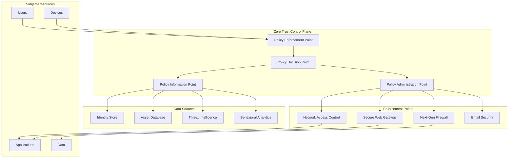
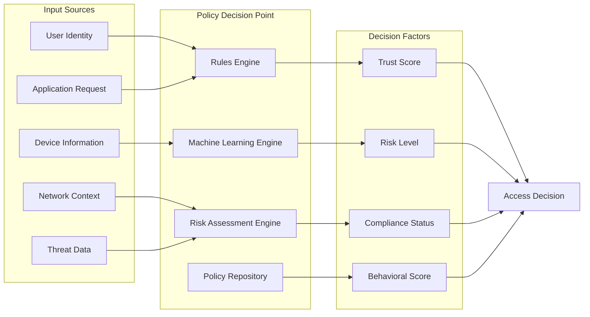
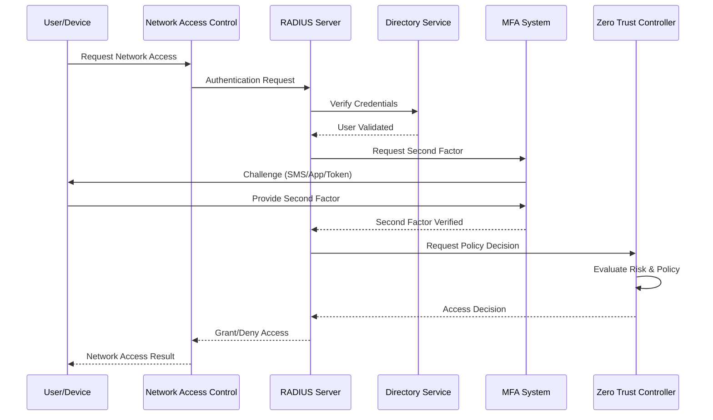
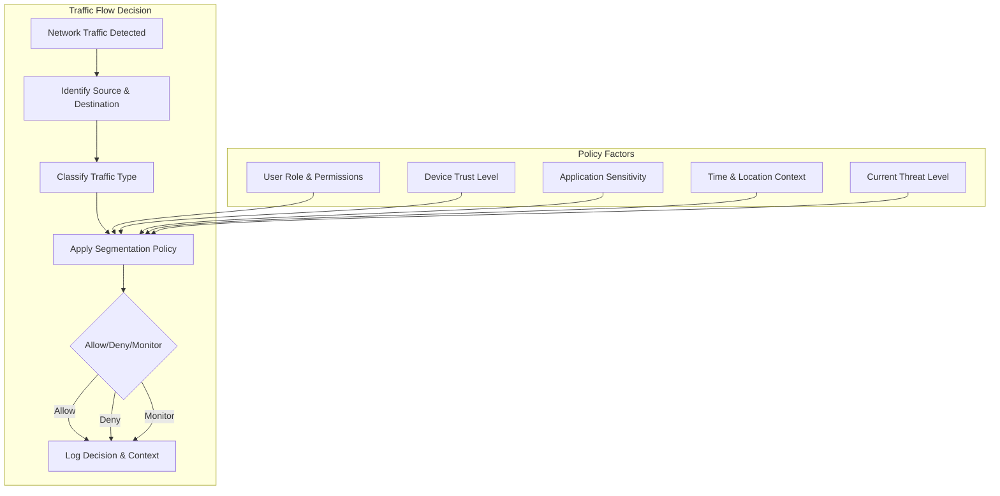
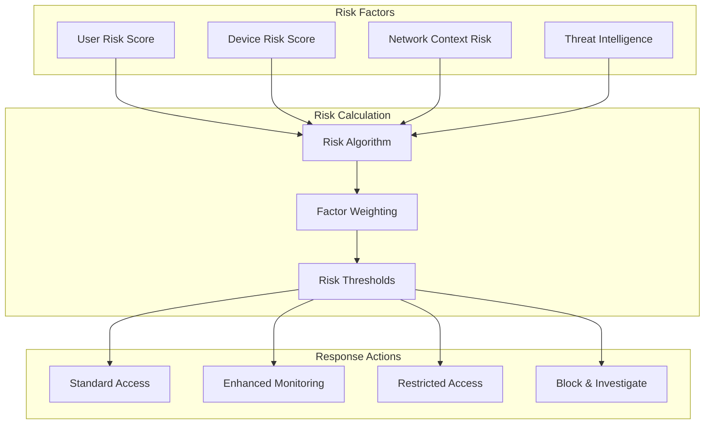

# Zero Trust Architecture Design

## 🛡️ Zero Trust Network Security Model

### Executive Summary

This document outlines the Zero Trust architecture implementation for the secure network design project, following NIST SP 800-207 guidelines and industry best practices. The Zero Trust model assumes no implicit trust and continuously validates every transaction and access request.

### Zero Trust Principles

#### Core Tenets
1. **Never Trust, Always Verify**: All users, devices, and network flows are authenticated and authorized
2. **Least Privilege Access**: Minimal access rights are granted for the minimum time necessary
3. **Assume Breach**: Security posture assumes attackers are present in the environment
4. **Verify Explicitly**: Authentication and authorization are based on all available data points
5. **Continuous Monitoring**: Real-time monitoring and behavioral analysis of all activities

## 🏗️ Zero Trust Architecture Components



### Policy Enforcement Points (PEP)

#### Network-Level Enforcement
- **Micro-segmentation**: Granular network segmentation down to individual device level
- **Software Defined Perimeter (SDP)**: Dynamic, encrypted tunnels for resource access
- **Identity-Based Access Control**: Network access tied to verified identity
- **Conditional Access**: Context-aware access decisions based on risk factors

#### Implementation Components
```yaml
enforcement_points:
  network_access_control:
    technology: "802.1X with EAP-TLS"
    coverage: "All network ports and wireless access points"
    features:
      - device_authentication
      - user_authentication
      - device_compliance_checking
      - dynamic_vlan_assignment
      - quarantine_capabilities

  next_generation_firewall:
    technology: "pfSense with advanced security features"
    deployment: "Distributed at network boundaries and internal segments"
    features:
      - application_aware_filtering
      - intrusion_prevention
      - ssl_inspection
      - threat_intelligence_integration
      - user_identity_integration

  secure_web_gateway:
    technology: "Squid with security extensions"
    deployment: "Centralized proxy with policy enforcement"
    features:
      - url_filtering
      - malware_detection
      - data_loss_prevention
      - ssl_inspection
      - bandwidth_management
```

### Policy Decision Point (PDP)

#### Decision Engine Architecture


#### Decision Matrix
| Risk Level | Trust Score | Device Compliance | Decision | Additional Controls |
|------------|-------------|-------------------|----------|-------------------|
| Low | High | Compliant | Allow | Standard monitoring |
| Low | High | Non-compliant | Allow with restrictions | Enhanced monitoring + remediation |
| Medium | High | Compliant | Allow with MFA | Continuous verification |
| Medium | Medium | Compliant | Allow with restrictions | Step-up authentication |
| High | Any | Any | Deny/Quarantine | Security investigation |

### Policy Information Point (PIP)

#### Data Sources Integration
```yaml
information_sources:
  identity_management:
    primary: "Active Directory / LDAP"
    secondary: "Multi-factor Authentication System"
    attributes:
      - user_identity
      - group_membership  
      - authentication_method
      - last_login_time
      - account_status

  device_management:
    primary: "Asset Management Database"
    secondary: "Mobile Device Management (MDM)"
    attributes:
      - device_identity
      - operating_system
      - patch_level
      - compliance_status
      - certificate_status
      - location

  network_context:
    primary: "Network Monitoring Systems"
    secondary: "Flow Analysis Tools"
    attributes:
      - source_location
      - destination_resource
      - network_path
      - traffic_patterns
      - anomaly_detection

  threat_intelligence:
    primary: "Threat Intelligence Platform"
    secondary: "Security Information and Event Management (SIEM)"
    attributes:
      - threat_indicators
      - risk_scores
      - attack_patterns
      - vulnerability_information
      - security_events
```

## 🔐 Identity and Access Management Integration

### Multi-Factor Authentication Architecture


### Device Trust and Compliance

#### Device Registration Process
1. **Device Discovery**: Automatic detection of new devices on the network
2. **Identity Verification**: Certificate-based device authentication
3. **Compliance Assessment**: Security posture evaluation
4. **Risk Scoring**: Behavioral and contextual risk assessment
5. **Access Decision**: Policy-based access control enforcement

#### Compliance Requirements
```yaml
device_compliance_policies:
  minimum_requirements:
    operating_system:
      windows:
        minimum_version: "Windows 10 20H2"
        required_updates: "All critical and security updates"
      macos:
        minimum_version: "macOS 12.0"
        required_updates: "Latest security updates"
      linux:
        distributions: ["Ubuntu 20.04+", "CentOS 8+", "RHEL 8+"]
        
    security_software:
      antivirus: "Real-time protection enabled"
      endpoint_detection: "EDR agent installed and reporting"
      encryption: "Full disk encryption enabled"
      
    certificate_requirements:
      device_certificate: "Valid PKI certificate"
      certificate_authority: "Trusted internal CA"
      certificate_expiry: "Not expired or near expiry (<30 days)"
```

## 🌐 Network Micro-Segmentation

### Segmentation Strategy
```yaml
microsegmentation:
  implementation_approach: "Software-Defined Networking (SDN)"
  granularity: "Application and user-based segmentation"
  
  segmentation_policies:
    horizontal_segmentation:
      description: "Isolation between network tiers"
      implementation:
        - production_dmz_isolation
        - development_production_separation
        - user_server_segmentation
        
    vertical_segmentation:
      description: "Isolation within the same network tier"
      implementation:
        - application_to_application
        - user_to_user_isolation
        - service_specific_segmentation
        
    dynamic_segmentation:
      description: "Real-time segmentation based on context"
      implementation:
        - threat_response_isolation
        - compliance_based_segmentation
        - behavioral_anomaly_isolation
```

### Micro-Segmentation Rules Engine


## 📊 Continuous Monitoring and Analytics

### Behavioral Analytics Engine
```yaml
behavioral_analytics:
  user_behavior_analysis:
    baseline_establishment:
      learning_period: "30 days minimum"
      data_points:
        - login_patterns
        - application_usage
        - data_access_patterns
        - network_locations
        - device_usage
        
    anomaly_detection:
      algorithms:
        - statistical_analysis
        - machine_learning
        - pattern_recognition
      
      anomaly_types:
        - unusual_login_times
        - abnormal_data_access
        - suspicious_network_behavior
        - privilege_escalation_attempts
        - lateral_movement_indicators

  device_behavior_analysis:
    normal_behavior_profile:
      - typical_network_connections
      - standard_application_usage
      - regular_communication_patterns
      - expected_data_flows
      
    suspicious_indicators:
      - unexpected_network_scanning
      - unusual_outbound_connections
      - abnormal_data_transfer_volumes
      - malware_communication_patterns
```

### Real-Time Risk Assessment


## 🚀 Implementation Roadmap

### Phase 1: Foundation (Weeks 1-2)
- [ ] Deploy identity infrastructure (LDAP, RADIUS, MFA)
- [ ] Implement basic network access control (NAC)
- [ ] Configure certificate-based device authentication
- [ ] Establish policy framework and initial rules

### Phase 2: Enforcement (Weeks 3-4)
- [ ] Deploy micro-segmentation infrastructure
- [ ] Implement application-aware firewall rules
- [ ] Configure behavioral analytics baseline
- [ ] Enable real-time policy enforcement

### Phase 3: Intelligence (Weeks 5-6)
- [ ] Deploy threat intelligence integration
- [ ] Implement machine learning for anomaly detection
- [ ] Configure automated response workflows
- [ ] Establish continuous risk assessment

### Phase 4: Optimization (Week 7)
- [ ] Fine-tune policies based on operational data
- [ ] Optimize performance and user experience
- [ ] Complete compliance validation
- [ ] Document operational procedures

## 📈 Success Metrics

### Technical Metrics
- **Authentication Success Rate**: >99.5% for legitimate users
- **False Positive Rate**: <2% for access decisions
- **Policy Enforcement Latency**: <100ms average decision time
- **Coverage**: 100% of network access points under Zero Trust control

### Security Metrics
- **Breach Detection Time**: <15 minutes for lateral movement attempts
- **Incident Response Time**: <30 minutes for high-risk events
- **Risk Accuracy**: >95% correlation between risk scores and actual threats
- **Compliance**: 100% adherence to Zero Trust principles

### Operational Metrics
- **User Experience**: <3 second authentication time
- **Administrative Overhead**: <10% increase in management tasks
- **System Uptime**: >99.9% availability of Zero Trust services
- **Policy Updates**: Automated deployment of >90% policy changes

---

This Zero Trust architecture provides a comprehensive security model that continuously verifies trust, enforces least privilege access, and assumes breach scenarios while maintaining usability and operational efficiency.