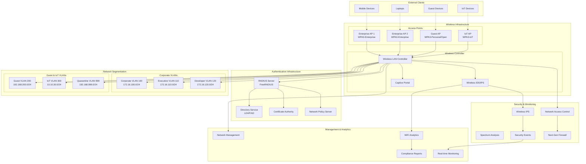

# 📡 Project 07: Enterprise WiFi Security & WPA3 Implementation

## 📋 Project Overview

**Objective**: Design and implement a comprehensive enterprise wireless security solution featuring WPA3, 802.1X authentication, wireless intrusion detection/prevention, secure guest networks, and advanced threat protection following industry best practices and compliance standards.

**Duration**: 4-6 weeks  
**Complexity**: Advanced  
**Technologies**: WPA3, 802.1X, EAP, RADIUS, WIDS/WIPS, Hostapd, FreeRADIUS, Kismet, Aircrack-ng

## 🎯 Learning Objectives

- Master WPA3 security protocols and implementation (SAE, PMF, OWE)
- Deploy enterprise 802.1X authentication with multiple EAP methods
- Implement wireless intrusion detection and prevention systems
- Design secure guest network architectures with isolation
- Develop wireless penetration testing methodologies
- Build comprehensive wireless monitoring and analytics solutions

## 🏗️ Architecture Overview



## 🛠️ Technical Specifications

### Wireless Security Standards
- **WPA3-Enterprise**: SAE with 192-bit security, PMF mandatory
- **WPA3-Personal**: Enhanced password security with SAE
- **WPA3-Transition**: Backward compatibility with WPA2
- **Enhanced Open**: OWE for guest networks without passwords
- **802.11w**: Protected Management Frames (PMF)
- **802.1X**: Port-based network access control

### EAP Authentication Methods
```yaml
eap_methods:
  eap_tls:
    description: "Certificate-based authentication"
    security_level: "High"
    use_cases:
      - corporate_devices
      - high_security_areas
      - executive_access
    certificate_requirements:
      - client_certificate
      - ca_certificate
      - private_key

  peap_mschapv2:
    description: "Password-based with TLS tunnel"
    security_level: "Medium"
    use_cases:
      - bring_your_own_device
      - temporary_access
      - legacy_clients
    authentication:
      - username_password
      - domain_authentication

  eap_ttls:
    description: "Tunneled TLS with various inner methods"
    security_level: "Medium-High"
    use_cases:
      - mixed_environments
      - legacy_compatibility
      - flexible_authentication

  eap_pwd:
    description: "Password-authenticated key exchange"
    security_level: "Medium"
    use_cases:
      - password_only_environments
      - no_certificate_infrastructure
```

### Network Segmentation Strategy
```yaml
vlan_design:
  corporate:
    vlan_100:
      name: "Corporate Users"
      subnet: "172.16.100.0/24"
      access_level: "full_internal"
      security_policies:
        - device_compliance_required
        - endpoint_protection_mandatory
        - data_loss_prevention
    
    vlan_110:
      name: "Executive Access"
      subnet: "172.16.110.0/24"
      access_level: "privileged"
      security_policies:
        - multi_factor_authentication
        - enhanced_monitoring
        - restricted_applications

  guest_networks:
    vlan_200:
      name: "Guest Access"
      subnet: "192.168.200.0/24"
      access_level: "internet_only"
      security_policies:
        - bandwidth_limitation
        - time_based_access
        - content_filtering
        - device_isolation

  iot_networks:
    vlan_300:
      name: "IoT Devices"
      subnet: "10.10.30.0/24"
      access_level: "restricted"
      security_policies:
        - device_profiling
        - micro_segmentation
        - anomaly_detection
```

## 📁 Project Structure

```
07-wireless-security/
├── README.md                          # This file
├── CHANGELOG.md                       # Version history
├── LICENSE                           # MIT License
├── Makefile                          # Build and deployment automation
├── docker-compose.yml                # Lab environment
├── vagrant/                          # VM provisioning
│   ├── Vagrantfile                   # Multi-VM wireless lab
│   └── provisioning/                 # Automated setup scripts
├── docs/                             # Documentation
│   ├── architecture/                 # Technical architecture
│   │   ├── wireless-architecture.md  # Overall wireless design
│   │   ├── security-model.md         # Security architecture
│   │   ├── network-design.md         # Network segmentation
│   │   └── threat-model.md           # Threat analysis
│   ├── security/                     # Security documentation
│   │   ├── wpa3-implementation.md    # WPA3 deployment guide
│   │   ├── eap-methods.md            # EAP authentication guide
│   │   ├── security-policies.md      # Wireless security policies
│   │   └── incident-response.md      # Wireless incident procedures
│   ├── implementation/               # Implementation guides
│   │   ├── deployment-guide.md       # Step-by-step deployment
│   │   ├── configuration-guide.md    # Configuration procedures
│   │   ├── testing-procedures.md     # Testing methodologies
│   │   └── troubleshooting.md        # Troubleshooting guide
│   └── compliance/                   # Compliance documentation
│       ├── nist-mapping.md           # NIST wireless standards
│       ├── pci-dss-wireless.md       # PCI-DSS compliance
│       └── hipaa-wireless.md         # HIPAA wireless requirements
├── src/                             # Source configurations
│   ├── configurations/              # Device configurations
│   │   ├── hostapd/                 # Access Point configurations
│   │   ├── freeradius/              # RADIUS server configs
│   │   ├── certificates/            # PKI certificates
│   │   └── network/                 # Network configurations
│   ├── scripts/                     # Automation scripts
│   │   ├── deployment/              # Deployment automation
│   │   ├── monitoring/              # Monitoring scripts
│   │   ├── security/                # Security validation
│   │   └── maintenance/             # Maintenance tasks
│   └── policies/                    # Security policies
│       ├── access-policies.json     # Access control policies
│       ├── security-rules.yaml      # Security rule definitions
│       └── compliance-checks.py     # Compliance validation
├── infrastructure/                  # Infrastructure setup
│   ├── lab-setup/                   # Lab environment
│   │   ├── virtual-aps/             # Virtual access points
│   │   ├── radius-server/           # RADIUS infrastructure
│   │   ├── certificate-authority/   # PKI setup
│   │   └── monitoring/              # Monitoring infrastructure
│   ├── automation/                  # Deployment automation
│   │   ├── ansible/                 # Ansible playbooks
│   │   ├── terraform/               # Infrastructure as code
│   │   └── scripts/                 # Shell scripts
│   └── monitoring/                  # Monitoring setup
│       ├── prometheus/              # Metrics collection
│       ├── grafana/                 # Visualization
│       └── elk/                     # Log analysis
├── tests/                           # Testing framework
│   ├── security-validation/         # Security tests
│   │   ├── wpa3-tests/              # WPA3 security validation
│   │   ├── eap-tests/               # EAP method testing
│   │   ├── isolation-tests/         # Network isolation tests
│   │   └── compliance-tests/        # Compliance validation
│   ├── penetration/                 # Penetration testing
│   │   ├── wireless-attacks/        # Attack simulations
│   │   ├── client-testing/          # Client security testing
│   │   ├── rogue-ap-detection/      # Rogue AP tests
│   │   └── social-engineering/      # WiFi social engineering
│   └── compliance/                  # Compliance testing
│       ├── pci-dss-tests/           # PCI-DSS validation
│       ├── hipaa-tests/             # HIPAA compliance
│       └── nist-tests/              # NIST standard tests
├── monitoring/                      # Monitoring & analytics
│   ├── wids-wips/                   # Wireless IDS/IPS
│   │   ├── kismet-config/           # Kismet configuration
│   │   ├── suricata-wireless/       # Suricata for wireless
│   │   └── custom-detection/        # Custom detection rules
│   ├── analytics/                   # Analytics engine
│   │   ├── client-behavior/         # Client behavior analysis
│   │   ├── performance-analytics/   # Performance monitoring
│   │   └── security-analytics/      # Security event analysis
│   └── reporting/                   # Reporting system
│       ├── compliance-reports/      # Compliance reporting
│       ├── security-dashboards/     # Security dashboards
│       └── performance-reports/     # Performance reports
├── tools/                           # Custom tools
│   ├── pentest/                     # Penetration testing tools
│   │   ├── wifi-scanner/            # Custom WiFi scanner
│   │   ├── evil-twin/               # Evil twin setup
│   │   ├── deauth-tool/             # Deauthentication tool
│   │   └── wps-attack/              # WPS attack tools
│   ├── analysis/                    # Analysis tools
│   │   ├── packet-analyzer/         # Custom packet analysis
│   │   ├── rf-analysis/             # RF spectrum analysis
│   │   └── client-profiler/         # Client device profiling
│   └── automation/                  # Automation utilities
│       ├── cert-management/         # Certificate automation
│       ├── config-generator/        # Configuration generation
│       └── health-checker/          # System health monitoring
└── examples/                        # Usage examples
    ├── configs/                     # Example configurations
    │   ├── enterprise-wifi/         # Enterprise setup examples
    │   ├── guest-networks/          # Guest network examples
    │   └── iot-segmentation/        # IoT network examples
    ├── scenarios/                   # Testing scenarios
    │   ├── attack-simulations/      # Attack scenario examples
    │   ├── compliance-demos/        # Compliance demonstrations
    │   └── performance-tests/       # Performance testing examples
    └── reports/                     # Sample reports
        ├── security-assessment/     # Security assessment reports
        ├── penetration-test/        # Pentest report examples
        └── compliance-audit/        # Compliance audit reports
```

## 🚀 Quick Start

### Prerequisites
- **Virtualization**: VMware/VirtualBox for wireless lab setup
- **Hardware**: USB WiFi adapters for testing (monitor mode capable)
- **Software**: Kali Linux, hostapd, FreeRADIUS, Kismet
- **Network**: Isolated test environment for security testing

### Lab Environment Setup
```bash
# Clone and navigate to project
cd projects/07-wireless-security

# Install dependencies and setup environment
make install

# Deploy wireless lab infrastructure
make lab-deploy

# Configure access points and RADIUS
make configure-infrastructure

# Deploy WPA3 security
make deploy-wpa3

# Setup monitoring and detection
make deploy-monitoring

# Validate security configuration
make security-validation
```

### Quick Demo
```bash
# Start complete wireless security lab
make demo-start

# Run security tests
make security-tests

# Generate compliance report
make compliance-report

# View monitoring dashboard
make dashboard
```

## 📊 Key Features

### 🔐 WPA3 Security Implementation
- **SAE (Simultaneous Authentication of Equals)**: Enhanced password security
- **192-bit Security**: Enterprise-grade encryption for high-security environments
- **Protected Management Frames (PMF)**: Mandatory frame protection
- **Enhanced Open**: Secure guest access without passwords using OWE
- **Forward Secrecy**: Protection against key compromise
- **Transition Modes**: Seamless migration from WPA2 to WPA3

### 🎫 Enterprise Authentication (802.1X)
- **Multiple EAP Methods**: EAP-TLS, PEAP-MSCHAPv2, EAP-TTLS, EAP-PWD
- **Certificate-Based Authentication**: PKI infrastructure integration
- **Dynamic VLAN Assignment**: Automatic network segmentation
- **Machine Authentication**: Device-based network access
- **User Authentication**: Credential-based access control
- **Guest Authentication**: Temporary access with time limits

### 🛡️ Wireless Intrusion Detection/Prevention
- **Rogue AP Detection**: Unauthorized access point identification
- **Evil Twin Detection**: Fake access point protection
- **Deauthentication Attack Prevention**: DoS attack mitigation
- **Client Behavior Analysis**: Anomalous device detection
- **Spectrum Monitoring**: RF interference and attack detection
- **Automated Response**: Real-time threat mitigation

### 🌐 Secure Guest Networks
- **Network Isolation**: Complete guest traffic segmentation
- **Captive Portal**: Web-based authentication and terms acceptance
- **Bandwidth Management**: QoS and rate limiting
- **Time-Based Access**: Session time restrictions
- **Voucher System**: Temporary access code generation
- **Content Filtering**: Web content security controls

### 📊 Monitoring & Analytics
- **Real-Time Monitoring**: Live wireless network visibility
- **Client Analytics**: Device behavior and performance analysis
- **RF Spectrum Analysis**: Wireless environment optimization
- **Security Event Correlation**: SIEM integration for threat detection
- **Performance Metrics**: Network performance and capacity monitoring
- **Compliance Reporting**: Automated regulatory compliance reports

## 🧪 Testing Framework

### Security Validation Tests
- **WPA3 Security Testing**: Protocol implementation validation
- **EAP Method Testing**: Authentication mechanism verification
- **Network Isolation Testing**: VLAN segmentation validation
- **Client Compliance Testing**: Device security posture verification

### Penetration Testing Suite
- **WPA/WPA2/WPA3 Attacks**: Protocol-specific attack simulations
- **Evil Twin Attacks**: Fake access point deployment
- **Deauthentication Attacks**: Client disconnection attacks
- **WPS Attacks**: WiFi Protected Setup vulnerabilities
- **Client-Side Attacks**: Device-specific security testing

### Compliance Testing
- **PCI-DSS Wireless**: Payment card industry compliance
- **HIPAA Wireless**: Healthcare information security
- **NIST Cybersecurity Framework**: Federal security standards
- **ISO 27001**: Information security management

## 🚦 Implementation Phases

### Phase 1: Infrastructure Setup (Week 1)
- Lab environment deployment with virtual access points
- RADIUS server configuration with LDAP integration
- Certificate authority setup for EAP-TLS authentication
- Basic network segmentation with VLAN configuration

### Phase 2: WPA3 & Authentication (Week 2)
- WPA3-Enterprise deployment with SAE configuration
- Multiple EAP method implementation and testing
- Dynamic VLAN assignment and policy enforcement
- Guest network deployment with captive portal

### Phase 3: Security Monitoring (Week 3)
- WIDS/WIPS deployment with rogue AP detection
- Spectrum analysis and RF monitoring setup
- Security event correlation and SIEM integration
- Automated threat response configuration

### Phase 4: Testing & Validation (Week 4-5)
- Comprehensive security testing suite deployment
- Penetration testing framework implementation
- Compliance validation and reporting setup
- Performance optimization and tuning

### Phase 5: Documentation & Compliance (Week 6)
- Complete technical documentation creation
- Compliance mapping and audit preparation
- Operational procedures and incident response
- Training materials and knowledge transfer

## 📋 Compliance Standards

### NIST Cybersecurity Framework
- **Identify (ID)**: Wireless asset inventory and risk assessment
- **Protect (PR)**: Access control and wireless security implementation
- **Detect (DE)**: Wireless intrusion detection and monitoring
- **Respond (RS)**: Incident response for wireless security events
- **Recover (RC)**: Wireless network recovery and continuity

### Industry Standards
- **IEEE 802.11i**: Wireless security standard compliance
- **IEEE 802.1X**: Port-based network access control
- **RFC 5216**: EAP-TLS authentication standard
- **WPA3 Specification**: WiFi Alliance security standard
- **FIPS 140-2**: Cryptographic module requirements

## 🎯 Success Criteria

### Technical Metrics
- [ ] **WPA3 Implementation**: 100% of enterprise SSIDs using WPA3-Enterprise
- [ ] **Authentication Success**: >99% successful EAP-TLS authentications
- [ ] **Network Isolation**: 100% traffic isolation between VLANs
- [ ] **Rogue AP Detection**: <30 seconds detection time for unauthorized APs
- [ ] **Performance**: No degradation in wireless performance with security enabled
- [ ] **Coverage**: 100% wireless coverage with security monitoring

### Security Metrics
- [ ] **Intrusion Detection**: 100% detection rate for known wireless attacks
- [ ] **False Positives**: <2% false positive rate for security alerts
- [ ] **Response Time**: <5 minutes automated response to security incidents
- [ ] **Compliance**: 100% compliance with security frameworks
- [ ] **Guest Isolation**: 100% isolation of guest traffic from corporate networks

### Operational Metrics
- [ ] **Availability**: >99.9% wireless network uptime
- [ ] **Management**: <10 minutes for common configuration changes
- [ ] **Monitoring**: 100% visibility into wireless network activities
- [ ] **Documentation**: Complete operational and security documentation
- [ ] **Training**: Network team trained on all wireless security procedures

## 🏆 Learning Outcomes

Upon completion, you will demonstrate:
- **WPA3 Expertise**: Advanced knowledge of WPA3 security protocols
- **802.1X Mastery**: Enterprise wireless authentication deployment
- **Wireless Security**: Comprehensive wireless threat detection and mitigation
- **Network Design**: Secure wireless network architecture and segmentation
- **Compliance Implementation**: Multi-standard wireless security compliance
- **Penetration Testing**: Wireless security assessment and testing capabilities

## 🤝 Contributing

1. Fork the repository
2. Create a feature branch (`git checkout -b feature/wireless-enhancement`)
3. Commit your changes (`git commit -m 'Add wireless security feature'`)
4. Push to the branch (`git push origin feature/wireless-enhancement`)
5. Open a Pull Request

## 📄 License

This project is licensed under the MIT License - see the [LICENSE](LICENSE) file for details.

## 🔗 References

- [WPA3 Specification - WiFi Alliance](https://www.wi-fi.org/discover-wi-fi/security)
- [IEEE 802.11i Standard](https://standards.ieee.org/standard/802_11i-2004.html)
- [NIST SP 800-153: Guidelines for Securing Wireless LANs](https://csrc.nist.gov/publications/detail/sp/800-153/final)
- [RFC 5216: EAP-TLS Authentication](https://tools.ietf.org/html/rfc5216)
- [PCI DSS Wireless Guidelines](https://www.pcisecuritystandards.org/)

---

**⚠️ Security Notice**: This project is designed for educational and controlled testing environments. All wireless security testing should be performed in isolated lab environments with proper authorization.

**📞 Support**: For questions or issues, please open a GitHub issue or contact the project maintainer.

**🏷️ Project Tags**: `wifi-security`, `wpa3`, `802.1x`, `wireless-authentication`, `wids-wips`, `enterprise-wifi`, `penetration-testing`