# 🔐 Project 08: Enterprise Identity & Access Management (IAM)

## 📋 Project Overview

**Objective**: Design and implement a comprehensive enterprise Identity and Access Management (IAM) solution featuring Active Directory integration, LDAP services, Single Sign-On (SSO) with SAML/OAuth, Multi-Factor Authentication (MFA), Privileged Access Management (PAM), and automated compliance frameworks following Zero Trust security principles.

**Duration**: 6-8 weeks  
**Complexity**: Advanced  
**Technologies**: Active Directory, LDAP, SAML 2.0, OAuth 2.0/OIDC, MFA, PAM, Keycloak, FreeIPA, Okta, Azure AD

## 🎯 Learning Objectives

- Master enterprise identity management architecture and design
- Deploy and configure Active Directory and LDAP directory services
- Implement Single Sign-On (SSO) with SAML and OAuth/OIDC protocols
- Design and deploy Multi-Factor Authentication (MFA) solutions
- Establish Privileged Access Management (PAM) controls
- Automate identity lifecycle management and access governance
- Implement Zero Trust access controls and continuous authentication
- Ensure compliance with identity and access regulations

## 🏗️ Architecture Overview

```mermaid
graph TB
    subgraph "Users & Devices"
        EMPLOYEES[Internal Employees]
        CONTRACTORS[External Contractors]
        PARTNERS[Business Partners]
        ADMINS[System Administrators]
        DEVICES[Corporate Devices]
        MOBILE[Mobile Devices]
        BYOD[BYOD Devices]
    end

    subgraph "Identity Providers"
        subgraph "Primary Directory Services"
            AD[Active Directory<br/>Domain Controller]
            LDAP[LDAP Server<br/>FreeIPA/389DS]
            AZURE_AD[Azure Active Directory<br/>Cloud Identity]
        end
        
        subgraph "Identity Federation"
            KEYCLOAK[Keycloak<br/>SSO Provider]
            SAML_IDP[SAML 2.0<br/>Identity Provider]
            OAUTH_SERVER[OAuth 2.0/OIDC<br/>Authorization Server]
        end
    end

    subgraph "Authentication Services"
        subgraph "Multi-Factor Authentication"
            MFA_SERVER[MFA Server<br/>FreeOTP/Authy]
            SMS_GATEWAY[SMS Gateway]
            PUSH_NOTIF[Push Notifications]
            HARDWARE_TOKENS[Hardware Tokens<br/>YubiKey/FIDO2]
            BIOMETRIC[Biometric Auth]
        end
        
        subgraph "Authentication Methods"
            PASSWORD[Password Auth]
            CERTIFICATE[Certificate Auth]
            KERBEROS[Kerberos SSO]
            RADIUS[RADIUS Auth]
        end
    end

    subgraph "Access Management"
        subgraph "Authorization Services"
            RBAC[Role-Based Access Control]
            ABAC[Attribute-Based Access Control]
            PBAC[Policy-Based Access Control]
            JUST_IN_TIME[Just-in-Time Access]
        end
        
        subgraph "Privileged Access Management"
            PAM_VAULT[PAM Vault<br/>CyberArk/Hashicorp]
            PRIV_SESSION[Privileged Sessions]
            PASSWORD_ROTATION[Password Rotation]
            SESSION_RECORDING[Session Recording]
        end
    end

    subgraph "Applications & Resources"
        subgraph "Enterprise Applications"
            ERP[ERP Systems]
            CRM[CRM Applications]
            HR_SYSTEMS[HR Systems]
            FINANCE[Financial Applications]
            EMAIL[Email Systems]
            COLLABORATION[Collaboration Tools]
        end
        
        subgraph "Cloud Services"
            AWS_IAM[AWS Identity Services]
            AZURE_RESOURCES[Azure Resources]
            GCP_IAM[GCP Identity Services]
            SAAS_APPS[SaaS Applications]
        end
        
        subgraph "Infrastructure"
            SERVERS[Server Infrastructure]
            DATABASES[Database Systems]
            NETWORK_DEVICES[Network Equipment]
            SECURITY_TOOLS[Security Tools]
        end
    end

    subgraph "Governance & Compliance"
        subgraph "Identity Governance"
            USER_LIFECYCLE[User Lifecycle Mgmt]
            ACCESS_REVIEW[Access Reviews]
            ATTESTATION[Access Attestation]
            SEGREGATION[Segregation of Duties]
        end
        
        subgraph "Compliance & Audit"
            COMPLIANCE_MONITOR[Compliance Monitoring]
            AUDIT_LOGS[Audit Logging]
            RISK_ASSESSMENT[Risk Assessment]
            VIOLATION_DETECTION[Violation Detection]
        end
    end

    subgraph "Monitoring & Analytics"
        subgraph "Security Monitoring"
            SIEM_INTEGRATION[SIEM Integration]
            THREAT_DETECTION[Threat Detection]
            ANOMALY_DETECTION[Anomaly Detection]
            IDENTITY_ANALYTICS[Identity Analytics]
        end
        
        subgraph "Operational Monitoring"
            PERFORMANCE_MONITOR[Performance Monitoring]
            AVAILABILITY_MONITOR[Availability Monitoring]
            CAPACITY_PLANNING[Capacity Planning]
            SLA_MONITORING[SLA Monitoring]
        end
    end

    %% User Authentication Flow
    EMPLOYEES --> AD
    CONTRACTORS --> LDAP
    PARTNERS --> KEYCLOAK
    ADMINS --> PAM_VAULT

    %% Identity Provider Connections
    AD --> KEYCLOAK
    LDAP --> KEYCLOAK
    AZURE_AD --> KEYCLOAK
    
    KEYCLOAK --> SAML_IDP
    KEYCLOAK --> OAUTH_SERVER

    %% Authentication Flow
    SAML_IDP --> MFA_SERVER
    OAUTH_SERVER --> MFA_SERVER
    
    MFA_SERVER --> SMS_GATEWAY
    MFA_SERVER --> PUSH_NOTIF
    MFA_SERVER --> HARDWARE_TOKENS
    MFA_SERVER --> BIOMETRIC

    %% Access Control Flow
    KEYCLOAK --> RBAC
    KEYCLOAK --> ABAC
    RBAC --> JUST_IN_TIME
    ABAC --> PBAC

    %% Application Access
    OAUTH_SERVER --> ERP
    OAUTH_SERVER --> CRM
    OAUTH_SERVER --> HR_SYSTEMS
    SAML_IDP --> FINANCE
    SAML_IDP --> EMAIL
    SAML_IDP --> COLLABORATION

    %% Cloud Integration
    AZURE_AD --> AWS_IAM
    AZURE_AD --> AZURE_RESOURCES
    AZURE_AD --> GCP_IAM
    KEYCLOAK --> SAAS_APPS

    %% Privileged Access
    PAM_VAULT --> SERVERS
    PAM_VAULT --> DATABASES
    PAM_VAULT --> NETWORK_DEVICES
    PAM_VAULT --> SECURITY_TOOLS

    %% Governance Integration
    AD --> USER_LIFECYCLE
    LDAP --> ACCESS_REVIEW
    KEYCLOAK --> ATTESTATION
    RBAC --> SEGREGATION

    %% Monitoring Integration
    KEYCLOAK --> SIEM_INTEGRATION
    PAM_VAULT --> AUDIT_LOGS
    MFA_SERVER --> THREAT_DETECTION
    ACCESS_REVIEW --> COMPLIANCE_MONITOR
```



## 🛠️ Technical Specifications

### Identity Directory Services
- **Active Directory**: Windows Server 2022 with domain services, GPO management
- **LDAP**: FreeIPA or 389 Directory Server with replication and SSL/TLS
- **Azure AD**: Cloud identity integration and hybrid connectivity
- **Directory Synchronization**: Azure AD Connect, LDAP Sync tools

### Single Sign-On (SSO) Protocols
```yaml
sso_implementations:
  saml_2_0:
    description: "Security Assertion Markup Language 2.0"
    use_cases:
      - enterprise_applications
      - web_based_sso
      - federated_identity
    features:
      - assertion_based_authentication
      - cross_domain_sso
      - attribute_sharing
      - logout_propagation

  oauth_2_0_oidc:
    description: "OAuth 2.0 with OpenID Connect"
    use_cases:
      - api_access_control
      - mobile_applications
      - microservices_authentication
      - third_party_integrations
    features:
      - token_based_authentication
      - scope_based_authorization
      - refresh_token_support
      - jwt_tokens

  kerberos:
    description: "Kerberos network authentication protocol"
    use_cases:
      - windows_domain_authentication
      - network_service_access
      - database_authentication
    features:
      - mutual_authentication
      - ticket_based_access
      - delegation_support
```

### Multi-Factor Authentication (MFA)
```yaml
mfa_methods:
  time_based_otp:
    description: "Time-based One-Time Password (TOTP)"
    providers:
      - google_authenticator
      - microsoft_authenticator
      - authy
      - freeotp
    algorithm: "HMAC-SHA1"
    time_window: 30_seconds

  sms_otp:
    description: "SMS-based One-Time Password"
    providers:
      - twilio
      - nexmo
      - aws_sns
    security_level: "medium"
    delivery_time: "< 30 seconds"

  push_notifications:
    description: "Mobile push notification approval"
    providers:
      - duo_security
      - microsoft_authenticator
      - okta_verify
    security_level: "high"
    user_experience: "seamless"

  hardware_tokens:
    description: "Physical security keys"
    standards:
      - fido2
      - webauthn
      - u2f
    devices:
      - yubikey
      - google_titan
      - rsa_securid
    security_level: "highest"

  biometric_authentication:
    description: "Biometric verification"
    methods:
      - fingerprint
      - face_recognition
      - voice_recognition
      - iris_scan
    security_level: "high"
    false_acceptance_rate: "< 0.001%"
```

### Privileged Access Management (PAM)
```yaml
pam_components:
  privileged_account_vault:
    description: "Centralized privileged credential storage"
    features:
      - encrypted_credential_storage
      - automatic_password_rotation
      - checkout_checkin_workflow
      - dual_control_approval
    supported_systems:
      - windows_servers
      - linux_servers
      - database_systems
      - network_devices
      - cloud_platforms

  privileged_session_management:
    description: "Secure privileged session access"
    features:
      - session_isolation
      - session_recording
      - real_time_monitoring
      - session_termination
    protocols:
      - rdp
      - ssh
      - database_connections
      - web_applications

  just_in_time_access:
    description: "Temporary elevated access provisioning"
    features:
      - time_limited_access
      - approval_workflows
      - automated_provisioning
      - access_revocation
    access_types:
      - administrative_accounts
      - service_accounts
      - application_access
      - database_access
```

## 📁 Project Structure

```
08-identity-access-management/
├── README.md                               # This file
├── CHANGELOG.md                            # Version history
├── LICENSE                                # MIT License
├── Makefile                               # Build and deployment automation
├── docker-compose.yml                     # Lab environment
├── vagrant/                               # VM provisioning
│   ├── Vagrantfile                        # Multi-VM IAM lab
│   └── provisioning/                      # Automated setup scripts
├── docs/                                  # Documentation
│   ├── architecture/                      # Technical architecture
│   │   ├── iam-architecture.md            # Overall IAM design
│   │   ├── identity-federation.md         # Federation architecture
│   │   ├── access-control-model.md        # Access control design
│   │   └── zero-trust-model.md            # Zero Trust architecture
│   ├── security/                          # Security documentation
│   │   ├── authentication-security.md     # Authentication security
│   │   ├── authorization-policies.md      # Authorization policies
│   │   ├── privileged-access-security.md  # PAM security controls
│   │   └── identity-threat-model.md       # Identity threat analysis
│   ├── implementation/                    # Implementation guides
│   │   ├── ad-deployment-guide.md         # Active Directory setup
│   │   ├── sso-implementation.md          # SSO deployment guide
│   │   ├── mfa-deployment.md              # MFA implementation
│   │   ├── pam-implementation.md          # PAM deployment
│   │   └── integration-guide.md           # System integration
│   └── compliance/                        # Compliance documentation
│       ├── identity-governance.md         # Identity governance
│       ├── sox-compliance.md              # SOX compliance
│       ├── gdpr-identity-privacy.md       # GDPR compliance
│       └── nist-identity-framework.md     # NIST framework mapping
├── src/                                   # Source configurations
│   ├── configurations/                    # Service configurations
│   │   ├── active-directory/              # AD configurations
│   │   ├── ldap/                         # LDAP server configs
│   │   ├── saml-oauth/                   # SSO configurations
│   │   ├── mfa/                          # MFA service configs
│   │   └── pam/                          # PAM configurations
│   ├── scripts/                          # Automation scripts
│   │   ├── deployment/                   # Deployment automation
│   │   ├── monitoring/                   # Monitoring scripts
│   │   ├── security/                     # Security validation
│   │   └── maintenance/                  # Maintenance tasks
│   └── policies/                         # Access policies
│       ├── rbac-policies.json            # Role-based access policies
│       ├── attribute-policies.yaml       # Attribute-based policies
│       └── compliance-policies.json      # Compliance policies
├── infrastructure/                        # Infrastructure setup
│   ├── lab-setup/                        # Lab environment
│   │   ├── active-directory/             # AD domain setup
│   │   ├── ldap-server/                  # LDAP infrastructure
│   │   ├── sso-providers/                # SSO infrastructure
│   │   ├── mfa-services/                 # MFA infrastructure
│   │   ├── pam-solutions/                # PAM infrastructure
│   │   └── monitoring/                   # Monitoring infrastructure
│   ├── automation/                       # Deployment automation
│   │   ├── ansible/                      # Ansible playbooks
│   │   ├── terraform/                    # Infrastructure as code
│   │   └── scripts/                      # Shell scripts
│   └── monitoring/                       # Monitoring setup
│       ├── prometheus/                   # Metrics collection
│       ├── grafana/                      # Visualization
│       └── elk/                          # Log analysis
├── tests/                                # Testing framework
│   ├── security-validation/              # Security tests
│   │   ├── authentication-tests/         # Authentication testing
│   │   ├── authorization-tests/          # Authorization testing
│   │   ├── sso-tests/                    # SSO functionality tests
│   │   ├── mfa-tests/                    # MFA validation
│   │   ├── pam-tests/                    # PAM security tests
│   │   └── compliance-tests/             # Compliance validation
│   ├── penetration/                      # Penetration testing
│   │   ├── identity-attacks/             # Identity-based attacks
│   │   ├── privilege-escalation/         # Privilege escalation
│   │   ├── sso-attacks/                  # SSO security testing
│   │   ├── mfa-bypass/                   # MFA bypass attempts
│   │   └── social-engineering/           # Social engineering tests
│   └── compliance/                       # Compliance testing
│       ├── nist-tests/                   # NIST framework tests
│       ├── iso27001-tests/               # ISO 27001 validation
│       ├── sox-tests/                    # SOX compliance tests
│       └── gdpr-tests/                   # GDPR compliance tests
├── monitoring/                           # Monitoring & analytics
│   ├── identity-analytics/               # Identity analytics
│   │   ├── user-behavior/                # User behavior analysis
│   │   ├── access-patterns/              # Access pattern analysis
│   │   ├── risk-analytics/               # Risk assessment
│   │   └── compliance-monitoring/        # Compliance monitoring
│   └── reporting/                        # Reporting system
│       ├── access-reports/               # Access reporting
│       ├── compliance-dashboards/        # Compliance dashboards
│       ├── security-reports/             # Security reporting
│       └── audit-reports/                # Audit reporting
├── tools/                                # Custom tools
│   ├── identity-management/              # Identity management tools
│   │   ├── user-provisioning/            # User lifecycle management
│   │   ├── password-management/          # Password management
│   │   ├── access-review/                # Access review tools
│   │   └── privilege-management/         # Privilege management
│   ├── security/                         # Security tools
│   │   ├── identity-scanner/             # Identity security scanner
│   │   ├── access-analyzer/              # Access analysis tools
│   │   ├── privilege-auditor/            # Privilege audit tools
│   │   └── compliance-checker/           # Compliance validation
│   └── automation/                       # Automation utilities
│       ├── user-lifecycle/               # User lifecycle automation
│       ├── access-automation/            # Access management automation
│       └── compliance-automation/        # Compliance automation
└── examples/                             # Usage examples
    ├── configs/                          # Example configurations
    │   ├── ad-configs/                   # AD configuration examples
    │   ├── ldap-configs/                 # LDAP configuration examples
    │   ├── sso-configs/                  # SSO configuration examples
    │   ├── mfa-configs/                  # MFA configuration examples
    │   └── pam-configs/                  # PAM configuration examples
    ├── scenarios/                        # Testing scenarios
    │   ├── identity-lifecycle/           # Identity lifecycle scenarios
    │   ├── access-scenarios/             # Access management scenarios
    │   ├── compliance-demos/             # Compliance demonstrations
    │   └── security-incidents/           # Security incident scenarios
    └── reports/                          # Sample reports
        ├── identity-assessments/         # Identity assessment reports
        ├── access-reviews/               # Access review reports
        ├── compliance-audits/            # Compliance audit reports
        └── penetration-tests/            # Penetration test reports
```

## 🚀 Quick Start

### Prerequisites
- **Virtualization**: VMware/VirtualBox for AD domain setup
- **Container Platform**: Docker and Docker Compose
- **Cloud Account**: Azure/AWS for cloud identity integration (optional)
- **Hardware**: 16GB RAM minimum (32GB recommended)
- **Storage**: 50GB disk space for lab environment

### Lab Environment Setup
```bash
# Clone and navigate to project
cd projects/08-identity-access-management

# Install dependencies and setup environment
make install

# Deploy IAM lab infrastructure
make lab-deploy

# Configure Active Directory domain
make setup-ad-domain

# Configure SSO providers
make setup-sso

# Deploy MFA services
make setup-mfa

# Configure PAM solution
make setup-pam

# Validate IAM configuration
make validate-iam
```

### Quick Demo
```bash
# Start complete IAM demonstration
make demo-start

# Test authentication methods
make test-authentication

# Test SSO functionality
make test-sso

# Test MFA enforcement
make test-mfa

# Generate compliance report
make compliance-report

# View IAM dashboards
make dashboard
```

## 📊 Key Features

### 🔑 Identity Management
- **Centralized Identity Store**: Unified user identity across all systems
- **User Lifecycle Management**: Automated onboarding, changes, and offboarding
- **Identity Federation**: Cross-domain identity sharing and trust relationships
- **Self-Service Portal**: User-managed password resets and profile updates
- **Identity Synchronization**: Real-time sync between multiple identity stores
- **Guest Identity Management**: Temporary access for external users

### 🔐 Authentication Services
- **Multi-Protocol Support**: SAML, OAuth, OIDC, Kerberos, RADIUS
- **Adaptive Authentication**: Risk-based authentication decisions
- **Multi-Factor Authentication**: TOTP, SMS, Push, Hardware tokens, Biometrics
- **Passwordless Authentication**: FIDO2, Windows Hello, certificate-based
- **Session Management**: Secure session handling and timeout controls
- **Certificate-Based Authentication**: PKI integration and smart card support

### 🎫 Authorization & Access Control
- **Role-Based Access Control (RBAC)**: Hierarchical role management
- **Attribute-Based Access Control (ABAC)**: Dynamic access decisions
- **Policy-Based Access Control (PBAC)**: Centralized policy management
- **Just-in-Time Access**: Temporary privilege elevation
- **Zero Trust Access**: Continuous verification and least privilege
- **Fine-Grained Permissions**: Application-level authorization controls

### 🛡️ Privileged Access Management
- **Privileged Account Vault**: Secure credential storage and rotation
- **Session Management**: Privileged session recording and monitoring
- **Approval Workflows**: Multi-step approval for privileged access
- **Emergency Access**: Break-glass procedures for critical situations
- **Privilege Analytics**: Usage monitoring and anomaly detection
- **Compliance Reporting**: Privileged access audit trails

### 📊 Identity Governance & Compliance
- **Access Reviews**: Periodic access certification and attestation
- **Segregation of Duties**: Conflicting access prevention
- **Compliance Monitoring**: Real-time compliance status tracking
- **Audit Trails**: Comprehensive logging of identity events
- **Risk Assessment**: Identity-based risk scoring and analytics
- **Violation Detection**: Automated policy violation alerts

## 🧪 Testing Framework

### Security Validation Tests
- **Authentication Security Testing**: Multi-protocol authentication validation
- **Authorization Testing**: RBAC/ABAC policy enforcement verification
- **SSO Security Testing**: SAML/OAuth security implementation validation
- **MFA Effectiveness Testing**: Multi-factor authentication bypass attempts
- **PAM Security Testing**: Privileged access control validation

### Penetration Testing Suite
- **Identity-Based Attacks**: Username enumeration, password attacks, token theft
- **Privilege Escalation**: Vertical and horizontal privilege escalation testing
- **SSO Attacks**: SAML/OAuth vulnerability exploitation
- **MFA Bypass Techniques**: MFA circumvention and social engineering
- **Directory Attacks**: LDAP injection, Kerberoasting, Golden Ticket attacks

### Compliance Testing
- **NIST Identity Framework**: Compliance with NIST 800-63 digital identity guidelines
- **SOX Compliance**: Sarbanes-Oxley identity and access controls
- **GDPR Privacy**: Data protection and privacy compliance for identity data
- **ISO 27001**: Information security management system compliance

## 🚦 Implementation Phases

### Phase 1: Foundation Setup (Week 1-2)
- Active Directory domain deployment and configuration
- LDAP directory service setup and integration
- Basic authentication mechanisms implementation
- Network infrastructure and security hardening

### Phase 2: SSO Implementation (Week 2-3)
- Keycloak SSO provider deployment and configuration
- SAML 2.0 identity provider setup and application integration
- OAuth 2.0/OIDC authorization server configuration
- Cross-domain federation and trust relationships

### Phase 3: Multi-Factor Authentication (Week 3-4)
- MFA service deployment (TOTP, SMS, Push notifications)
- Hardware token integration (FIDO2, YubiKey)
- Biometric authentication setup and testing
- Adaptive authentication policy configuration

### Phase 4: Privileged Access Management (Week 4-5)
- PAM vault deployment and privileged account management
- Privileged session management and recording
- Just-in-time access workflows and approval processes
- Emergency access procedures and break-glass accounts

### Phase 5: Governance & Compliance (Week 5-6)
- Identity governance workflows and access reviews
- Compliance monitoring and reporting automation
- Risk analytics and anomaly detection implementation
- Audit trail configuration and log management

### Phase 6: Security & Testing (Week 6-7)
- Comprehensive security testing and penetration testing
- Compliance validation and audit preparation
- Performance optimization and scalability testing
- Disaster recovery and business continuity planning

### Phase 7: Documentation & Training (Week 7-8)
- Complete technical documentation and runbooks
- User training materials and administrator guides
- Compliance documentation and audit evidence
- Knowledge transfer and operational handover

## 📋 Compliance Standards

### Identity Security Frameworks
- **NIST 800-63**: Digital Identity Guidelines for authentication and lifecycle management
- **NIST Cybersecurity Framework**: Identity and access management controls
- **ISO 27001**: Information security management system requirements
- **CIS Controls**: Critical security controls for identity and access management

### Regulatory Compliance
- **SOX (Sarbanes-Oxley)**: Financial reporting and access controls
- **GDPR (General Data Protection Regulation)**: Privacy and data protection
- **CCPA (California Consumer Privacy Act)**: Consumer privacy rights
- **HIPAA**: Healthcare information privacy and security

### Industry Standards
- **SAML 2.0**: Security Assertion Markup Language specification
- **OAuth 2.0**: Authorization framework specification
- **OpenID Connect**: Identity layer on top of OAuth 2.0
- **FIDO2/WebAuthn**: Modern authentication standards

## 🎯 Success Criteria

### Technical Metrics
- [ ] **Identity Integration**: 100% of enterprise applications integrated with SSO
- [ ] **Authentication Success**: >99.5% successful authentication rate
- [ ] **MFA Adoption**: 100% of privileged accounts protected with MFA
- [ ] **SSO Performance**: <2 seconds average SSO response time
- [ ] **Directory Availability**: 99.9% uptime for identity services
- [ ] **Privileged Access**: 100% of privileged accounts under PAM control

### Security Metrics
- [ ] **Access Review Coverage**: 100% of user accounts reviewed quarterly
- [ ] **Policy Violations**: <1% policy violation rate with automatic remediation
- [ ] **Privileged Session Monitoring**: 100% of privileged sessions recorded
- [ ] **Threat Detection**: <5 minutes detection time for identity-based attacks
- [ ] **Compliance Score**: 100% compliance with regulatory requirements

### Operational Metrics
- [ ] **User Self-Service**: 80% of password resets through self-service
- [ ] **Provisioning Time**: <4 hours for new user account creation
- [ ] **Access Request Processing**: <2 business days average approval time
- [ ] **Identity Sync**: <5 minutes synchronization between identity stores
- [ ] **Audit Response**: <24 hours for audit data retrieval

## 🏆 Learning Outcomes

Upon completion, you will demonstrate:
- **IAM Architecture**: Comprehensive understanding of enterprise identity architecture
- **Directory Services**: Advanced Active Directory and LDAP administration
- **SSO Implementation**: Expert-level SAML and OAuth implementation skills
- **MFA Deployment**: Multi-factor authentication design and deployment
- **PAM Management**: Privileged access management and security controls
- **Identity Governance**: Access governance, reviews, and compliance management
- **Security Assessment**: Identity security testing and vulnerability assessment
- **Compliance Management**: Multi-regulatory compliance implementation

## 🤝 Contributing

1. Fork the repository
2. Create a feature branch (`git checkout -b feature/iam-enhancement`)
3. Commit your changes (`git commit -m 'Add IAM security feature'`)
4. Push to the branch (`git push origin feature/iam-enhancement`)
5. Open a Pull Request

## 📄 License

This project is licensed under the MIT License - see the [LICENSE](LICENSE) file for details.

## 🔗 References

- [NIST SP 800-63: Digital Identity Guidelines](https://pages.nist.gov/800-63-3/)
- [SAML 2.0 Specification](https://docs.oasis-open.org/security/saml/v2.0/)
- [OAuth 2.0 Authorization Framework](https://tools.ietf.org/html/rfc6749)
- [OpenID Connect Specification](https://openid.net/connect/)
- [FIDO Alliance Standards](https://fidoalliance.org/specifications/)
- [Microsoft Active Directory Documentation](https://docs.microsoft.com/en-us/windows-server/identity/ad-ds/)

---

**⚠️ Security Notice**: This project involves identity and access management systems that control access to sensitive resources. All testing should be performed in isolated lab environments with proper authorization and security controls.

**📞 Support**: For questions or issues, please open a GitHub issue or contact the project maintainer.

**🏷️ Project Tags**: `identity-management`, `access-control`, `single-sign-on`, `multi-factor-authentication`, `privileged-access-management`, `active-directory`, `ldap`, `saml`, `oauth`, `compliance`