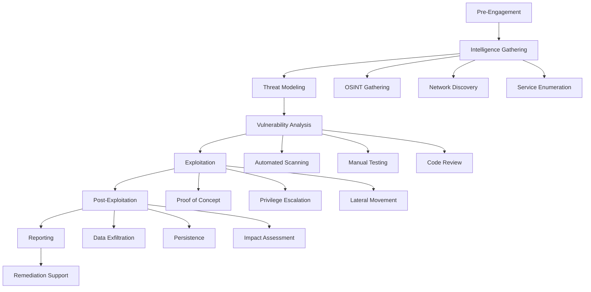
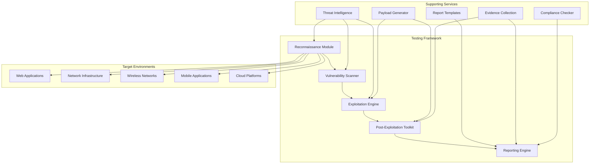
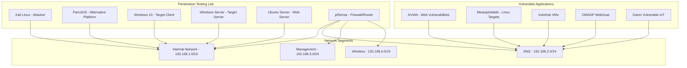

# Project 12: Penetration Testing Framework

## Overview

This project implements a comprehensive penetration testing framework designed for professional security assessments, vulnerability research, and red team exercises. The framework integrates industry-standard methodologies (OWASP, PTES, NIST), automated tools, and custom scripts to provide a structured approach to penetration testing across web applications, networks, wireless systems, and mobile platforms.

## Project Objectives

### Learning Objectives
- Understand comprehensive penetration testing methodologies and frameworks
- Master industry-standard penetration testing tools and techniques
- Implement automated vulnerability discovery and exploitation workflows
- Develop custom penetration testing tools and scripts
- Create professional penetration testing reports and documentation
- Build secure testing environments with vulnerable applications
- Integrate threat intelligence and OSINT into testing processes
- Understand legal and ethical considerations in penetration testing

### Technical Objectives
- Deploy a complete penetration testing lab environment with Docker
- Implement OWASP Top 10 testing procedures and automation
- Build reconnaissance and information gathering automation
- Create exploitation frameworks with payload management
- Develop post-exploitation persistence and privilege escalation tools
- Implement automated reporting and documentation systems
- Integrate with vulnerability management and threat intelligence platforms
- Build compliance frameworks for penetration testing standards

## Architecture Overview

### Penetration Testing Methodology


### Framework Architecture


### Testing Lab Environment


## Core Components

### 1. Reconnaissance Module
Advanced information gathering and OSINT capabilities:

```bash path=null start=null
# Passive reconnaissance
./scripts/reconnaissance/passive_recon.py --domain example.com
./scripts/reconnaissance/osint_gathering.sh -t company_name

# Active reconnaissance  
./scripts/reconnaissance/network_discovery.py --range 192.168.1.0/24
./scripts/reconnaissance/service_enumeration.py --host 192.168.1.10
```

**Features:**
- Automated OSINT collection from multiple sources
- DNS enumeration and subdomain discovery
- Network topology mapping and service fingerprinting
- Social engineering intelligence gathering
- Threat intelligence integration

### 2. Vulnerability Assessment Engine
Comprehensive vulnerability discovery and analysis:

```bash path=null start=null
# Automated vulnerability scanning
./scripts/scanning/comprehensive_scan.py --target 192.168.1.10
./scripts/scanning/web_app_scan.py --url https://example.com

# Manual testing procedures
./scripts/scanning/manual_checklist.py --type web-app
./scripts/scanning/compliance_check.py --framework owasp-top10
```

**Features:**
- Multi-protocol vulnerability scanning (HTTP/HTTPS, SSH, SMB, etc.)
- OWASP Top 10 automated testing procedures
- Custom vulnerability detection rules
- False positive reduction and validation
- Integration with CVE databases

### 3. Exploitation Framework
Structured exploitation with payload management:

```bash path=null start=null
# Exploit development and testing
./scripts/exploitation/exploit_builder.py --vuln CVE-2023-1234
./scripts/exploitation/payload_generator.py --type reverse-shell

# Exploitation execution
./scripts/exploitation/auto_exploit.py --target 192.168.1.10 --vuln sql-injection
./scripts/exploitation/manual_exploit.py --interactive
```

**Features:**
- Custom exploit development framework
- Automated payload generation and encoding
- Multi-stage exploitation workflows
- Exploit chaining and combination attacks
- Safe exploitation with rollback capabilities

### 4. Post-Exploitation Toolkit
Advanced post-exploitation and persistence mechanisms:

```bash path=null start=null
# Post-exploitation activities
./scripts/post-exploitation/privilege_escalation.py --os linux
./scripts/post-exploitation/lateral_movement.py --method ssh-keys

# Data collection and persistence
./scripts/post-exploitation/data_collection.py --type sensitive
./scripts/post-exploitation/persistence.py --method registry-keys
```

**Features:**
- Automated privilege escalation techniques
- Lateral movement and network propagation
- Data exfiltration and collection frameworks
- Persistence mechanism deployment
- Anti-forensics and stealth techniques

### 5. Automated Reporting System
Professional reporting with evidence management:

```bash path=null start=null
# Report generation
./scripts/reporting/generate_report.py --template executive --output pdf
./scripts/reporting/technical_report.py --findings high,critical

# Evidence management
./scripts/reporting/evidence_collector.py --session pentest-2024-01
./scripts/reporting/compliance_report.py --standard pci-dss
```

**Features:**
- Multiple report templates (Executive, Technical, Compliance)
- Automated evidence collection and organization
- Risk scoring and prioritization
- Remediation recommendations
- Compliance mapping (PCI-DSS, HIPAA, SOX)

## Framework Integration

### OWASP Testing Guide Implementation
Complete implementation of OWASP Testing Guide v4.2:

```bash path=null start=null
# Information Gathering (WSTG-INFO)
./frameworks/owasp/info_gathering.py --comprehensive

# Configuration and Deployment Management (WSTG-CONF)
./frameworks/owasp/config_testing.py --web-server apache

# Identity Management (WSTG-IDNT)
./frameworks/owasp/identity_testing.py --auth-mechanism oauth

# Authentication (WSTG-ATHN)
./frameworks/owasp/auth_testing.py --bypass-techniques

# Authorization (WSTG-ATHZ)
./frameworks/owasp/authz_testing.py --privilege-escalation

# Session Management (WSTG-SESS)
./frameworks/owasp/session_testing.py --cookie-analysis

# Input Validation (WSTG-INPV)
./frameworks/owasp/input_validation.py --injection-types all

# Error Handling (WSTG-ERRH)
./frameworks/owasp/error_handling.py --information-disclosure

# Cryptography (WSTG-CRYP)
./frameworks/owasp/crypto_testing.py --weak-algorithms

# Business Logic (WSTG-BUSL)
./frameworks/owasp/business_logic.py --workflow-bypass

# Client Side (WSTG-CLNT)
./frameworks/owasp/client_testing.py --dom-xss
```

### PTES Framework Integration
Professional penetration testing execution standard:

```bash path=null start=null
# Pre-engagement Interactions
./frameworks/ptes/pre_engagement.py --scoping --rules-of-engagement

# Intelligence Gathering
./frameworks/ptes/intelligence.py --passive --active --comprehensive

# Threat Modeling
./frameworks/ptes/threat_modeling.py --attack-vectors --impact-analysis

# Vulnerability Analysis
./frameworks/ptes/vuln_analysis.py --automated --manual --validation

# Exploitation
./frameworks/ptes/exploitation.py --proof-of-concept --impact-demo

# Post Exploitation
./frameworks/ptes/post_exploit.py --persistence --privilege-escalation

# Reporting
./frameworks/ptes/reporting.py --executive --technical --remediation
```

## Target Environments

### Web Application Testing
Comprehensive web application security assessment:

```yaml path=null start=null
web_testing:
  information_gathering:
    - robots_txt_analysis
    - sitemap_discovery
    - technology_fingerprinting
    - directory_enumeration
  
  authentication_testing:
    - brute_force_attacks
    - session_management_flaws
    - password_reset_vulnerabilities
    - multi_factor_bypass
  
  authorization_testing:
    - privilege_escalation
    - forced_browsing
    - parameter_manipulation
    - path_traversal
  
  input_validation:
    - sql_injection
    - xss_attacks
    - command_injection
    - file_upload_vulnerabilities
  
  business_logic:
    - workflow_bypass
    - race_conditions
    - process_timing_attacks
    - data_validation_errors
```

### Network Penetration Testing
Infrastructure and network security assessment:

```yaml path=null start=null
network_testing:
  reconnaissance:
    - network_discovery
    - port_scanning
    - service_enumeration
    - os_fingerprinting
  
  vulnerability_assessment:
    - automated_scanning
    - manual_validation
    - configuration_review
    - patch_management_analysis
  
  exploitation:
    - service_exploitation
    - privilege_escalation
    - lateral_movement
    - persistent_access
  
  wireless_testing:
    - wpa_wpa2_attacks
    - enterprise_wireless
    - bluetooth_assessment
    - rogue_access_points
```

### Mobile Application Testing
iOS and Android application security assessment:

```yaml path=null start=null
mobile_testing:
  static_analysis:
    - source_code_review
    - binary_analysis
    - configuration_review
    - third_party_libraries
  
  dynamic_analysis:
    - runtime_manipulation
    - api_testing
    - data_storage_analysis
    - network_communication
  
  platform_specific:
    ios:
      - ios_app_transport_security
      - keychain_analysis
      - jailbreak_detection_bypass
    android:
      - manifest_analysis
      - intent_security
      - root_detection_bypass
```

## Tools Integration

### Industry Standard Tools
- **Reconnaissance**: Nmap, Masscan, Amass, Recon-ng, TheHarvester
- **Web Testing**: Burp Suite, OWASP ZAP, SQLmap, Nikto, Gobuster
- **Network Testing**: Nessus, OpenVAS, Metasploit, Empire, Cobalt Strike
- **Exploitation**: Metasploit, ExploitDB, Custom exploits
- **Post-Exploitation**: Empire, Covenant, PoshC2, Custom implants

### Custom Tools Development
```bash path=null start=null
# Custom vulnerability scanner
./tools/custom/vuln_scanner.py --target-type web --deep-scan

# Automated exploit chaining
./tools/custom/exploit_chain.py --target 192.168.1.10 --chain-file chains/web_to_system.json

# Custom payload generator
./tools/custom/payload_gen.py --type shellcode --arch x64 --os windows

# Automated post-exploitation
./tools/automated/auto_post_exploit.py --session 1 --objectives data-exfil,persistence
```

## Lab Environment

### Vulnerable Applications
Complete testing environment with vulnerable applications:

```yaml path=null start=null
services:
  # Web vulnerabilities
  dvwa:
    image: vulnerables/web-dvwa
    ports: ["80:80"]
    environment:
      - MYSQL_DATABASE=dvwa
  
  webgoat:
    image: webgoat/webgoat-8.0
    ports: ["8080:8080"]
  
  mutillidae:
    image: citizenstig/nowasp
    ports: ["8081:80"]
  
  # Network vulnerabilities
  metasploitable:
    image: tleemcjr/metasploitable2
    ports: ["2222:22", "8082:80"]
  
  # Database testing
  mysql_vulnerable:
    image: mysql:5.7
    environment:
      - MYSQL_ROOT_PASSWORD=vulnerable
      - MYSQL_DATABASE=testdb
    ports: ["3306:3306"]
  
  # Wireless testing simulation
  wireless_sim:
    image: custom/wireless-simulator
    privileged: true
    ports: ["8083:80"]
```

### Monitoring and Logging
Comprehensive logging and monitoring for testing activities:

```yaml path=null start=null
monitoring:
  elk_stack:
    elasticsearch:
      image: docker.elastic.co/elasticsearch/elasticsearch:7.14.0
    logstash:
      image: docker.elastic.co/logstash/logstash:7.14.0  
    kibana:
      image: docker.elastic.co/kibana/kibana:7.14.0
      ports: ["5601:5601"]
  
  security_monitoring:
    falco:
      image: falcosecurity/falco
      privileged: true
    
    suricata:
      image: jasonish/suricata:latest
      network_mode: host
```

## Testing Procedures

### Automated Testing Workflows
```bash path=null start=null
# Full penetration test automation
make pentest-full TARGET=192.168.1.10 OUTPUT_DIR=./reports/client-2024-01

# Web application testing
make web-test URL=https://example.com DEPTH=comprehensive

# Network penetration test
make network-test RANGE=192.168.1.0/24 THREADS=50

# Compliance testing
make compliance-test FRAMEWORK=owasp-top10 TARGET_TYPE=web-app
```

### Manual Testing Procedures
Structured manual testing with checklists and validation:

```bash path=null start=null
# Interactive testing session
./scripts/testing/interactive_session.py --target-type network --methodology ptes

# Manual vulnerability validation
./scripts/testing/manual_validation.py --finding-id VULN-2024-001

# Custom exploit development
./scripts/testing/exploit_dev.py --vuln-type buffer-overflow --target-arch x64
```

## Reporting and Documentation

### Report Templates
Professional reporting templates for different audiences:

- **Executive Summary**: High-level risk assessment and business impact
- **Technical Report**: Detailed findings with proof-of-concept
- **Remediation Guide**: Step-by-step fix instructions
- **Compliance Report**: Mapping to regulatory requirements

### Evidence Management
Automated evidence collection and organization:

```bash path=null start=null
# Evidence collection
./scripts/reporting/collect_evidence.py --session-id PENTEST-2024-001

# Screenshot automation
./scripts/reporting/auto_screenshot.py --exploit-session 1234

# Log analysis and extraction
./scripts/reporting/extract_logs.py --timeframe "2024-01-01 to 2024-01-07"
```

## Security and Compliance

### Ethical Guidelines
- Only test systems with explicit written permission
- Maintain confidentiality of all discovered vulnerabilities
- Follow responsible disclosure practices
- Respect system availability and data integrity
- Comply with local and international laws

### Legal Considerations
- Written authorization before testing
- Clear scope definition and boundaries
- Data handling and protection agreements
- Incident response procedures
- Professional liability considerations

### Compliance Standards
- **OWASP**: Web application security testing standards
- **PTES**: Professional penetration testing execution standard
- **NIST SP 800-115**: Technical guide to information security testing
- **ISO 27001**: Information security management requirements
- **PCI-DSS**: Payment card industry security requirements

## Getting Started

### Prerequisites
- Linux-based testing platform (Kali Linux recommended)
- Docker and Docker Compose for lab environment
- Python 3.8+ with security libraries
- 16GB+ RAM and 100GB+ storage
- Network isolation for testing activities

### Quick Start
```bash path=null start=null
# Clone and setup
git clone <repository>
cd projects/12-penetration-testing-framework

# Install dependencies
make install

# Deploy lab environment
make lab-deploy

# Run initial health checks
make health-check

# Start basic penetration test
make pentest-basic TARGET=192.168.1.10
```

### Environment Setup
```bash path=null start=null
# Install testing tools
make install-tools

# Configure target environments
make setup-targets

# Initialize reporting system
make init-reporting

# Setup monitoring and logging
make setup-monitoring
```

## Advanced Features

### AI-Powered Testing
Integration of machine learning for enhanced testing:

```bash path=null start=null
# ML-powered vulnerability prediction
./tools/ai/vuln_predictor.py --target-analysis --model trained_model.pkl

# Automated exploit generation
./tools/ai/exploit_generator.py --vulnerability CVE-2023-1234

# Intelligent fuzzing
./tools/ai/smart_fuzzer.py --target-api https://api.example.com --ml-guided
```

### Threat Intelligence Integration
Real-time threat intelligence integration:

```bash path=null start=null
# IOC-based testing
./scripts/threat-intel/ioc_testing.py --feed misp --indicators malware-domains

# TTP-based attack simulation  
./scripts/threat-intel/ttp_simulation.py --technique T1055 --framework mitre-attack

# Threat landscape analysis
./scripts/threat-intel/landscape_analysis.py --sector healthcare --geography global
```

## Contributing

### Development Guidelines
- Follow secure coding practices
- Document all tools and techniques
- Include test cases and validation
- Maintain professional ethics
- Contribute to open-source security community

### Testing Standards
- All tools must be tested in isolated environment
- Include unit tests for custom tools
- Validate against known vulnerable applications
- Document false positive rates
- Performance benchmarking required

## License

This penetration testing framework is released under the MIT License with additional security and ethical use clauses. See LICENSE file for full terms.

## Disclaimer

This framework is intended for authorized penetration testing and security research only. Users are responsible for ensuring compliance with all applicable laws and regulations. Unauthorized use of these tools may be illegal and unethical.

---

**Project Status**: Active Development  
**Version**: 1.0.0  
**Last Updated**: January 2024  
**Maintainer**: Cybersecurity Portfolio Project