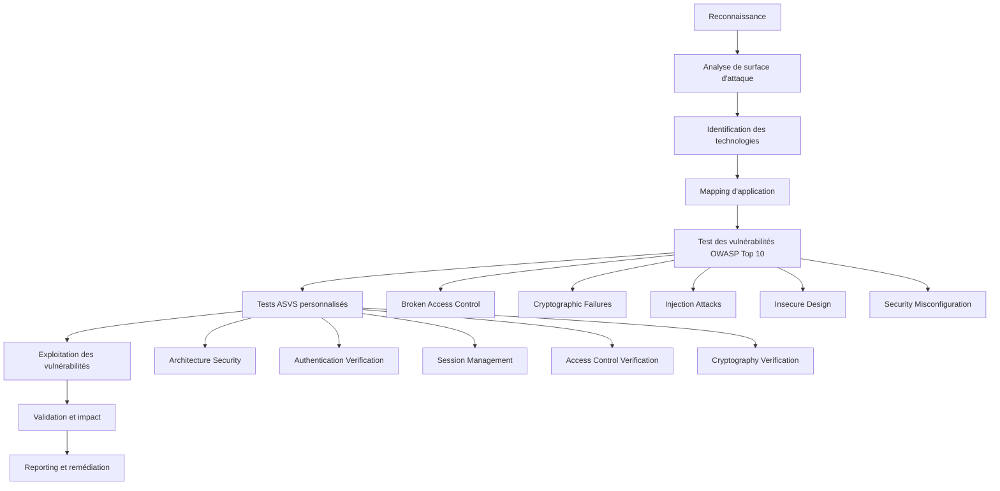
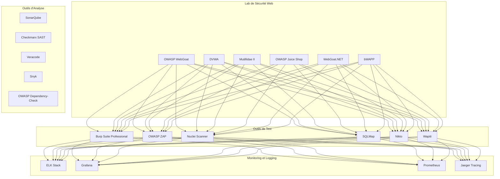

# Projet 13 : Web Application Security Testing

## Vue d'ensemble

Ce projet implémente un framework complet de test de sécurité des applications web, intégrant les dernières méthodologies OWASP (Top 10 2021, ASVS 4.0), les outils d'analyse automatisés, et les procédures de test manuelles. Le framework couvre l'ensemble du cycle de vie de test de sécurité des applications web, depuis la reconnaissance jusqu'au reporting professionnel en passant par l'exploitation et la validation des vulnérabilités.

## Objectifs du projet

### Objectifs d'apprentissage
- Maîtriser les méthodologies OWASP Top 10 2021 et ASVS 4.0
- Comprendre les techniques avancées de test de sécurité web
- Implémenter des outils d'analyse automatisés et manuels
- Développer des compétences en exploitation de vulnérabilités web
- Créer des rapports de sécurité professionnels et conformes
- Intégrer les tests de sécurité dans les pipelines DevSecOps
- Maîtriser l'analyse statique et dynamique du code

### Objectifs techniques
- Déployer un laboratoire complet de test de sécurité web
- Implémenter l'OWASP Testing Guide v4.2 complet
- Développer des outils custom d'analyse de sécurité
- Créer des frameworks d'automatisation de tests
- Intégrer des outils de CI/CD pour la sécurité
- Implémenter des tableaux de bord de monitoring avancés
- Développer des capacités d'analyse forensique web

## Architecture du framework

### Méthodologie de test de sécurité web


### Architecture du framework de test
```mermaid
graph TB
    subgraph "Framework de Test Web"
        A[Module de Reconnaissance] --> B[Scanner de Vulnérabilités]
        B --> C[Moteur d'Exploitation]
        C --> D[Module de Validation]
        D --> E[Générateur de Rapports]
    end
    
    subgraph "Applications Cibles"
        F[Applications Web Modernes]
        G[API REST/GraphQL]
        H[Applications SPA]
        I[Applications Mobile Web]
        J[Applications Legacy]
    end
    
    subgraph "Outils d'Analyse"
        K[Analyse Statique (SAST)]
        L[Analyse Dynamique (DAST)]
        M[Analyse Interactive (IAST)]
        N[Composition Analysis (SCA)]
        O[Infrastructure as Code]
    end
    
    A --> F & G & H & I & J
    K & L & M & N & O --> B
    E --> P[Rapports OWASP]
    E --> Q[Rapports ASVS]
    E --> R[Rapports Conformité]
```

### Environnement de laboratoire


## Composants principaux

### 1. Module de Reconnaissance Web
Collecte d'informations avancée et cartographie d'applications :

```bash path=null start=null
# Reconnaissance passive
./scripts/scanning/web_recon.py --domain example.com --passive
./scripts/scanning/subdomain_enum.py --domain example.com --sources all

# Reconnaissance active
./scripts/scanning/tech_stack_detection.py --url https://example.com
./scripts/scanning/endpoint_discovery.py --url https://example.com --wordlist custom

# Analyse d'infrastructure
./scripts/scanning/infrastructure_analysis.py --target example.com
./scripts/scanning/cdn_detection.py --url https://example.com
```

**Fonctionnalités :**
- Énumération de sous-domaines avec sources multiples
- Détection de stack technologique avancée
- Découverte d'endpoints et de contenus cachés
- Analyse de l'infrastructure et des configurations
- Cartographie automatisée des applications

### 2. Scanner OWASP Top 10 2021
Tests automatisés pour chaque catégorie OWASP :

```bash path=null start=null
# A01:2021 - Broken Access Control
./scripts/testing/access_control_test.py --url https://example.com --comprehensive

# A02:2021 - Cryptographic Failures
./scripts/testing/crypto_failures_test.py --url https://example.com --ssl --encryption

# A03:2021 - Injection
./scripts/testing/injection_test.py --url https://example.com --all-types

# A04:2021 - Insecure Design
./scripts/testing/insecure_design_test.py --url https://example.com --business-logic

# A05:2021 - Security Misconfiguration
./scripts/testing/misconfig_test.py --url https://example.com --comprehensive
```

**Tests implémentés :**
- **A01 - Broken Access Control** : IDOR, privilege escalation, path traversal
- **A02 - Cryptographic Failures** : weak encryption, exposed sensitive data
- **A03 - Injection** : SQL, NoSQL, LDAP, OS command injection
- **A04 - Insecure Design** : business logic flaws, threat modeling gaps
- **A05 - Security Misconfiguration** : default configs, verbose errors
- **A06 - Vulnerable Components** : dependency analysis, version checking
- **A07 - Authentication Failures** : weak passwords, session management
- **A08 - Data Integrity Failures** : unsigned software, CI/CD pipeline security
- **A09 - Logging Failures** : insufficient logging, monitoring gaps
- **A10 - SSRF** : server-side request forgery attacks

### 3. Framework ASVS 4.0
Vérification complète selon l'OWASP Application Security Verification Standard :

```bash path=null start=null
# V1: Architecture, Design and Threat Modeling
./frameworks/asvs/v1_architecture.py --url https://example.com --level 2

# V2: Authentication Verification Requirements
./frameworks/asvs/v2_authentication.py --url https://example.com --comprehensive

# V3: Session Management Verification Requirements
./frameworks/asvs/v3_session.py --url https://example.com --advanced

# V4: Access Control Verification Requirements
./frameworks/asvs/v4_access_control.py --url https://example.com --rbac

# V5: Validation, Sanitization and Encoding
./frameworks/asvs/v5_validation.py --url https://example.com --input-validation
```

**Niveaux de vérification ASVS :**
- **Niveau 1** : Vérification opportuniste pour toutes applications
- **Niveau 2** : Standard pour applications contenant données sensibles
- **Niveau 3** : Niveau le plus élevé pour applications critiques

### 4. Moteur d'Analyse Automatisé
Intégration d'outils multiples pour analyse complète :

```bash path=null start=null
# Analyse statique (SAST)
./scripts/analysis/static_analysis.py --source-path /app/src --language java

# Analyse dynamique (DAST)
./scripts/analysis/dynamic_analysis.py --url https://example.com --deep-scan

# Analyse interactive (IAST)
./scripts/analysis/interactive_analysis.py --app-url https://example.com --agent-config iast.conf

# Analyse de composition (SCA)
./scripts/analysis/composition_analysis.py --project-path /app --check-licenses
```

**Outils intégrés :**
- **SAST** : SonarQube, Checkmarx, Veracode, Semgrep
- **DAST** : Burp Suite, OWASP ZAP, Nuclei, Wapiti
- **IAST** : Contrast Security, Seeker, agents personnalisés
- **SCA** : Snyk, OWASP Dependency-Check, WhiteSource

### 5. Module d'Exploitation Avancé
Validation des vulnérabilités avec proof-of-concept :

```bash path=null start=null
# Exploitation SQL Injection
./scripts/exploitation/sqli_exploit.py --url https://example.com/login --payload union

# Exploitation XSS
./scripts/exploitation/xss_exploit.py --url https://example.com/search --type reflected

# Exploitation CSRF
./scripts/exploitation/csrf_exploit.py --url https://example.com/transfer --generate-poc

# Exploitation d'upload de fichiers
./scripts/exploitation/file_upload_exploit.py --url https://example.com/upload --bypass-filters
```

**Techniques d'exploitation :**
- Injection SQL avec extraction de données
- Cross-Site Scripting (XSS) avec payloads avancés
- Cross-Site Request Forgery (CSRF) avec génération de PoC
- Exploitation d'upload de fichiers avec bypass de filtres
- Exploitation de vulnérabilités logiques métier

## Tests OWASP spécialisés

### OWASP Top 10 2021 - Tests détaillés

#### A01:2021 - Broken Access Control
Tests complets de contrôle d'accès :

```yaml path=null start=null
access_control_tests:
  horizontal_privilege_escalation:
    - idor_object_references
    - user_id_manipulation
    - session_token_manipulation
  
  vertical_privilege_escalation:
    - admin_function_access
    - role_manipulation
    - privilege_elevation
  
  path_traversal:
    - directory_traversal
    - file_inclusion_attacks
    - path_manipulation
  
  business_logic:
    - workflow_bypass
    - price_manipulation
    - quantity_manipulation
```

#### A03:2021 - Injection
Tests d'injection exhaustifs :

```yaml path=null start=null
injection_tests:
  sql_injection:
    - union_based
    - boolean_based
    - time_based
    - error_based
    - second_order
  
  nosql_injection:
    - mongodb_injection
    - couchdb_injection
    - redis_injection
  
  command_injection:
    - os_command_injection
    - code_injection
    - expression_injection
  
  ldap_injection:
    - authentication_bypass
    - information_disclosure
```

#### A07:2021 - Identification and Authentication Failures
Tests d'authentification avancés :

```yaml path=null start=null
authentication_tests:
  password_security:
    - weak_password_policy
    - default_credentials
    - password_brute_force
    - credential_stuffing
  
  session_management:
    - session_fixation
    - session_hijacking
    - insufficient_session_expiration
    - concurrent_sessions
  
  multi_factor_authentication:
    - mfa_bypass
    - backup_codes_security
    - biometric_authentication
```

### ASVS 4.0 - Verification détaillée

#### V2: Authentication Verification Requirements
```bash path=null start=null
# V2.1: Password Security Requirements
./frameworks/asvs/v2_1_passwords.py --check-policy --strength-testing

# V2.2: General Authenticator Requirements
./frameworks/asvs/v2_2_authenticators.py --multi-factor --biometric

# V2.3: Authenticator Lifecycle Requirements
./frameworks/asvs/v2_3_lifecycle.py --registration --recovery

# V2.4: Credential Storage Requirements
./frameworks/asvs/v2_4_storage.py --encryption --salting --hashing
```

#### V4: Access Control Verification Requirements
```bash path=null start=null
# V4.1: General Access Control Design
./frameworks/asvs/v4_1_design.py --principle-least-privilege --deny-default

# V4.2: Operation Level Access Control
./frameworks/asvs/v4_2_operations.py --crud-operations --business-functions

# V4.3: Other Access Control Considerations
./frameworks/asvs/v4_3_other.py --directory-traversal --file-permissions
```

## Intégration DevSecOps

### Pipeline CI/CD de Sécurité
Integration dans les pipelines de développement :

```yaml path=null start=null
# .gitlab-ci.yml exemple
stages:
  - static-analysis
  - dependency-check
  - dynamic-testing
  - security-reporting

sast_scan:
  stage: static-analysis
  script:
    - make sast-scan SOURCE_PATH=./src
    - make sast-report
  artifacts:
    reports:
      sast: sast-report.json

dast_scan:
  stage: dynamic-testing
  script:
    - make deploy-test-app
    - make dast-scan TARGET_URL=$TEST_APP_URL
    - make dast-report
  artifacts:
    reports:
      dast: dast-report.json
```

### Tests de sécurité automatisés
```bash path=null start=null
# Tests pré-commit
make pre-commit-security-check

# Tests de construction
make build-security-scan

# Tests de déploiement
make deployment-security-validation

# Tests post-déploiement
make production-security-monitoring
```

## Outils et technologies

### Outils d'analyse principaux
- **Burp Suite Professional** : Proxy et scanner web avancé
- **OWASP ZAP** : Scanner de sécurité open-source
- **Nuclei** : Scanner de vulnérabilités haute vitesse
- **SQLMap** : Outil d'exploitation SQL injection
- **Nikto** : Scanner de serveurs web
- **Wapiti** : Scanner de vulnérabilités web

### Outils SAST/DAST
- **SonarQube** : Analyse de qualité et sécurité du code
- **Checkmarx** : Analyse statique enterprise
- **Veracode** : Plateforme de sécurité applicative
- **Snyk** : Analyse de dépendances et conteneurs
- **OWASP Dependency-Check** : Analyse de vulnérabilités de dépendances

### Plateformes de test
- **OWASP WebGoat** : Plateforme d'apprentissage sécurité web
- **DVWA** : Application web délibérément vulnérable
- **OWASP Juice Shop** : Application moderne vulnérable
- **Mutillidae II** : Application web vulnérable avancée
- **bWAPP** : Application web vulnérable PHP

## Environnement de laboratoire

### Applications vulnérables
Déploiement complet d'applications de test :

```yaml path=null start=null
services:
  # Applications d'apprentissage OWASP
  webgoat:
    image: webgoat/goatandwolf
    ports: ["8080:8080", "9090:9090"]
  
  juice-shop:
    image: bkimminich/juice-shop
    ports: ["3000:3000"]
  
  dvwa:
    image: vulnerables/web-dvwa
    ports: ["80:80"]
  
  # Applications de test avancées
  mutillidae:
    image: citizenstig/nowasp
    ports: ["8081:80"]
  
  bwapp:
    image: raesene/bwapp
    ports: ["8082:80"]
  
  # API vulnérables
  vulnerable-api:
    image: matthamil/vulnerable-api
    ports: ["8083:3000"]
```

### Outils de monitoring
Surveillance complète des tests et de la sécurité :

```yaml path=null start=null
monitoring:
  # Stack ELK pour les logs
  elasticsearch:
    image: docker.elastic.co/elasticsearch/elasticsearch:7.17.0
  logstash:
    image: docker.elastic.co/logstash/logstash:7.17.0
  kibana:
    image: docker.elastic.co/kibana/kibana:7.17.0
  
  # Métriques et alertes
  prometheus:
    image: prom/prometheus
  grafana:
    image: grafana/grafana
  
  # Tracing distribué
  jaeger:
    image: jaegertracing/all-in-one
```

## Procédures de test

### Tests automatisés complets
```bash path=null start=null
# Test OWASP Top 10 complet
make owasp-top10-test TARGET_URL=https://example.com

# Test ASVS niveau 2
make asvs-level2-test TARGET_URL=https://example.com

# Test de régression sécurité
make security-regression-test CONFIG=regression.yml

# Test de performance sécurisé
make security-performance-test LOAD=1000users
```

### Tests manuels guidés
Procédures structurées pour tests manuels :

```bash path=null start=null
# Session de test interactif
./scripts/testing/interactive_web_test.py --url https://example.com --methodology owasp

# Validation manuelle de vulnérabilités
./scripts/testing/manual_validation.py --finding-id WEB-2024-001

# Exploitation guidée
./scripts/testing/guided_exploitation.py --vulnerability-type sqli --target-url https://example.com
```

## Reporting et conformité

### Rapports professionnels
Génération de rapports multiples formats :

- **Rapport Exécutif** : Synthèse des risques et recommandations business
- **Rapport Technique** : Détails des vulnérabilités avec PoC
- **Rapport OWASP** : Conformité OWASP Top 10 et ASVS
- **Rapport de Conformité** : Mapping réglementaire (PCI-DSS, SOX, etc.)

### Templates de reporting
```bash path=null start=null
# Génération de rapports
./scripts/reporting/generate_web_security_report.py \
  --session WEB-2024-001 \
  --template executive \
  --format pdf

# Rapport de conformité ASVS
./scripts/reporting/asvs_compliance_report.py \
  --session WEB-2024-001 \
  --level 2 \
  --format json,pdf

# Métriques de sécurité
./scripts/reporting/security_metrics.py \
  --timeframe "last-30-days" \
  --dashboard grafana
```

## Conformité et standards

### Standards implémentés
- **OWASP Top 10 2021** : Tests complets des 10 risques principaux
- **OWASP ASVS 4.0** : Vérification selon les 3 niveaux
- **OWASP Testing Guide v4.2** : Méthodologie de test complète
- **SANS Top 25** : Erreurs de programmation dangereuses
- **NIST Cybersecurity Framework** : Contrôles de sécurité applicative

### Conformité réglementaire
- **PCI-DSS** : Exigences pour applications de paiement
- **HIPAA** : Sécurité des données de santé
- **SOX** : Contrôles pour applications financières
- **GDPR** : Protection des données personnelles
- **ISO 27001** : Management de la sécurité de l'information

## Démarrage rapide

### Prérequis
- Docker et Docker Compose
- Python 3.8+ avec bibliothèques de sécurité
- Java 11+ pour outils SAST
- 16GB+ RAM et 100GB+ stockage
- Accès réseau pour téléchargement d'outils

### Installation rapide
```bash path=null start=null
# Clonage et configuration
git clone <repository>
cd projects/13-web-application-security

# Installation des dépendances
make install

# Déploiement du laboratoire
make lab-deploy

# Vérification de santé
make health-check

# Premier test de sécurité
make quick-security-test TARGET_URL=http://localhost:3000
```

### Configuration de l'environnement
```bash path=null start=null
# Installation des outils de test
make install-security-tools

# Configuration des applications cibles
make setup-target-apps

# Initialisation du système de reporting
make init-reporting-system

# Configuration du monitoring
make setup-security-monitoring
```

## Fonctionnalités avancées

### Intelligence artificielle pour la sécurité
Intégration de l'IA pour améliorer les tests :

```bash path=null start=null
# Prédiction de vulnérabilités par IA
./tools/ai/vulnerability_predictor.py --source-code /app/src --model trained_model.pkl

# Génération automatique de payloads
./tools/ai/payload_generator.py --vulnerability-type xss --context form-input

# Analyse comportementale des applications
./tools/ai/behavioral_analysis.py --traffic-log access.log --detect-anomalies
```

### Tests de sécurité API
Tests spécialisés pour APIs REST et GraphQL :

```bash path=null start=null
# Test d'API REST
./scripts/api/rest_security_test.py --openapi-spec api-spec.yml

# Test d'API GraphQL
./scripts/api/graphql_security_test.py --endpoint https://api.example.com/graphql

# Test d'authentification API
./scripts/api/api_auth_test.py --api-key $API_KEY --jwt-token $JWT_TOKEN
```

### Intégration avec threat intelligence
Enrichissement des tests avec renseignements sur les menaces :

```bash path=null start=null
# Tests basés sur les IOCs
./scripts/threat-intel/ioc_based_testing.py --feed misp --indicators web-threats

# Simulation d'attaques TTPs
./scripts/threat-intel/ttp_simulation.py --technique T1190 --framework mitre-attack

# Analyse du paysage des menaces
./scripts/threat-intel/threat_landscape.py --sector web-apps --geography global
```

## Contribution et développement

### Guidelines de développement
- Suivre les meilleures pratiques de sécurité
- Documenter tous les outils et techniques
- Inclure des cas de test et validation
- Maintenir l'éthique professionnelle
- Contribuer à la communauté open-source sécurité

### Standards de test
- Tous les outils doivent être testés en environnement isolé
- Inclure des tests unitaires pour outils custom
- Valider contre des applications vulnérables connues
- Documenter les taux de faux positifs
- Benchmarks de performance requis

## Licence

Ce framework de test de sécurité web est publié sous licence MIT avec des clauses additionnelles de sécurité et d'usage éthique. Voir le fichier LICENSE pour les conditions complètes.

## Avertissement

Ce framework est destiné aux tests de sécurité autorisés et à la recherche en sécurité uniquement. Les utilisateurs sont responsables de s'assurer de la conformité avec toutes les lois et réglementations applicables. L'usage non autorisé de ces outils peut être illégal et contraire à l'éthique.

---

**Statut du projet** : Développement actif  
**Version** : 1.0.0  
**Dernière mise à jour** : Janvier 2025  
**Mainteneur** : Projet Portfolio Cybersécurité