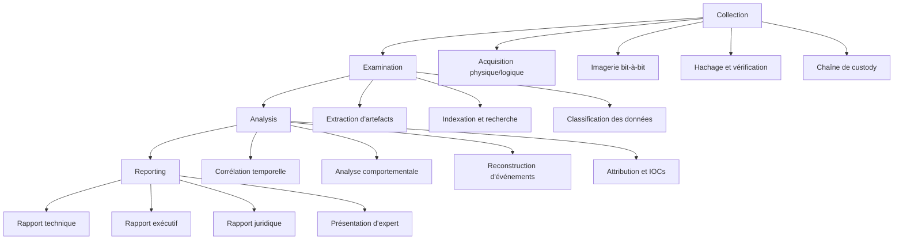
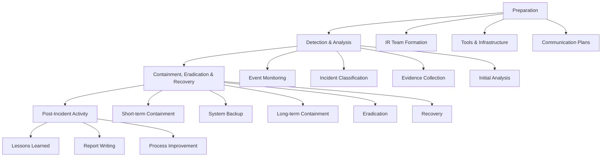
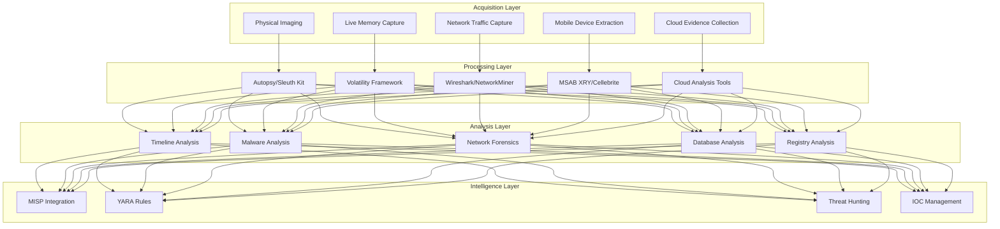

# Projet 14 : Digital Forensics & Incident Response

## Vue d'ensemble

Ce projet implémente un framework complet de criminalistique numérique (digital forensics) et de réponse aux incidents, intégrant les méthodologies NIST, SANS et ENISA pour la collecte, l'analyse et la présentation de preuves numériques. Le framework couvre l'ensemble du cycle de vie de la réponse aux incidents, depuis la détection initiale jusqu'à la remédiation et la génération de rapports juridiquement admissibles.

## Objectifs du projet

### Objectifs d'apprentissage
- Maîtriser les méthodologies de criminalistique numérique (NIST SP 800-86, SANS DFIR)
- Comprendre les procédures de réponse aux incidents selon NIST SP 800-61
- Développer des compétences en analyse forensique (disque, mémoire, réseau, mobile)
- Apprendre la gestion de la chaîne de custody et de l'intégrité des preuves
- Créer des rapports d'expertise technique et juridique
- Intégrer l'automatisation dans les processus forensiques
- Maîtriser l'analyse malware et la threat intelligence

### Objectifs techniques
- Déployer un laboratoire complet de criminalistique numérique
- Implémenter des workflows de réponse aux incidents automatisés
- Développer des outils d'analyse forensique personnalisés
- Créer des playbooks de réponse structurés
- Intégrer des plateformes SOAR (Security Orchestration & Response)
- Implémenter des systèmes de gestion de cas et preuves
- Développer des capacités d'analyse en temps réel

## Architecture du framework

### Méthodologie NIST pour la criminalistique numérique


### Processus de réponse aux incidents NIST SP 800-61


### Architecture du laboratoire forensique


## Composants principaux

### 1. Module d'acquisition forensique
Collecte sécurisée et vérifiable des preuves numériques :

```bash path=null start=null
# Acquisition d'image disque
./scripts/acquisition/disk_imaging.py --device /dev/sdb --output case-001.dd --hash sha256

# Capture mémoire live
./scripts/acquisition/memory_capture.py --target 192.168.1.100 --method lime

# Extraction mobile
./scripts/acquisition/mobile_extract.py --device android --method adb --full

# Acquisition réseau
./scripts/acquisition/network_capture.py --interface eth0 --duration 3600 --filter "host 192.168.1.10"
```

**Fonctionnalités :**
- Imagerie physique et logique de disques
- Capture mémoire volatile (RAM)
- Extraction de données mobiles (iOS/Android)
- Capture de trafic réseau en temps réel
- Acquisition de preuves cloud (Office 365, Google Workspace)
- Vérification d'intégrité par hachage cryptographique

### 2. Moteur d'analyse forensique
Traitement et analyse des preuves collectées :

```bash path=null start=null
# Analyse d'image disque
./scripts/analysis/disk_analysis.py --image case-001.dd --filesystem ntfs --output report.json

# Analyse de mémoire
./scripts/analysis/memory_analysis.py --dump memory.mem --profile Win10x64 --plugins all

# Analyse réseau
./scripts/analysis/network_analysis.py --pcap traffic.pcap --extract-files --malware-scan

# Timeline forensique
./scripts/analysis/timeline_analysis.py --sources disk,memory,network --case case-001
```

**Outils intégrés :**
- **Autopsy/Sleuth Kit** : Analyse de systèmes de fichiers
- **Volatility** : Analyse mémoire volatile
- **Wireshark/Tshark** : Analyse de trafic réseau
- **YARA** : Détection de patterns et malware
- **Sigma** : Détection d'activité suspecte

### 3. Framework de réponse aux incidents
Orchestration automatisée de la réponse aux incidents :

```bash path=null start=null
# Détection d'incident
./scripts/incident-response/incident_detector.py --sources siem,edr,ids --threshold high

# Classification automatique
./scripts/incident-response/incident_classifier.py --event-data events.json --ml-model classifier.pkl

# Containment automatique
./scripts/incident-response/auto_containment.py --incident INC-2024-001 --level moderate

# Collecte d'artefacts
./scripts/incident-response/artifact_collector.py --hosts affected_hosts.txt --timeline 24h
```

**Playbooks intégrés :**
- Malware infection response
- Data breach investigation
- APT campaign analysis
- Insider threat investigation
- DDoS attack response

### 4. Système de gestion de cas
Gestion complète du cycle de vie des investigations :

```bash path=null start=null
# Création de cas
./scripts/case-management/create_case.py --title "Data Breach Investigation" --severity high

# Gestion des preuves
./scripts/case-management/evidence_manager.py --case CASE-001 --add-evidence disk.dd

# Chaîne de custody
./scripts/case-management/chain_of_custody.py --evidence EVD-001 --action transfer --to analyst

# Rapport de cas
./scripts/case-management/case_report.py --case CASE-001 --template legal --output court-ready.pdf
```

**Fonctionnalités :**
- Tracking des cas et incidents
- Gestion de la chaîne de custody
- Collaboration d'équipe
- Audit trail complet
- Notifications et alertes

### 5. Laboratoire d'analyse malware
Environnement sécurisé pour l'analyse de malware :

```bash path=null start=null
# Analyse statique
./scripts/malware-analysis/static_analysis.py --sample malware.exe --sandbox isolated

# Analyse dynamique
./scripts/malware-analysis/dynamic_analysis.py --sample malware.exe --vm windows10 --time 600

# Analyse comportementale
./scripts/malware-analysis/behavior_analysis.py --sample malware.exe --monitor network,filesystem

# Génération de signatures
./scripts/malware-analysis/signature_generator.py --sample malware.exe --output yara_rules.yar
```

**Environnements d'analyse :**
- Sandboxes isolés (Cuckoo, CAPE)
- Machines virtuelles dédiées
- Analyse réseau isolée
- Reverse engineering tools
- Automated malware classification

## Workflows forensiques spécialisés

### Investigation de violation de données
Procédure complète d'investigation de data breach :

```yaml path=null start=null
data_breach_workflow:
  phase_1_preparation:
    - incident_response_team_activation
    - legal_notification_requirements
    - communication_plan_activation
    - evidence_preservation_order
  
  phase_2_identification:
    - affected_systems_identification
    - data_classification_review
    - attack_vector_analysis
    - timeline_establishment
  
  phase_3_containment:
    - immediate_containment_actions
    - affected_accounts_isolation
    - network_segmentation
    - backup_verification
  
  phase_4_eradication:
    - malware_removal
    - vulnerability_patching
    - credential_reset
    - system_hardening
  
  phase_5_recovery:
    - system_restoration
    - monitoring_enhancement
    - business_continuity
    - validation_testing
  
  phase_6_lessons_learned:
    - incident_documentation
    - process_improvement
    - training_updates
    - compliance_reporting
```

### Analyse forensique mobile
Investigation spécialisée des appareils mobiles :

```yaml path=null start=null
mobile_forensics_workflow:
  acquisition:
    ios_devices:
      - logical_acquisition_itunes
      - physical_acquisition_checkm8
      - cloud_acquisition_icloud
      - keychain_extraction
    
    android_devices:
      - adb_logical_extraction
      - fastboot_physical_imaging
      - jtag_chip_off_analysis
      - rooted_physical_acquisition
  
  analysis:
    communication_analysis:
      - sms_mms_reconstruction
      - call_log_analysis
      - messaging_apps_data
      - voicemail_recovery
    
    location_analysis:
      - gps_coordinate_extraction
      - location_history_reconstruction
      - wifi_connection_mapping
      - cell_tower_analysis
    
    application_analysis:
      - installed_apps_inventory
      - app_data_extraction
      - deleted_data_recovery
      - app_permissions_analysis
```

### Analyse forensique réseau
Investigation des incidents réseau :

```yaml path=null start=null
network_forensics_workflow:
  traffic_analysis:
    capture_methods:
      - span_port_monitoring
      - tap_deployment
      - router_netflow_analysis
      - firewall_log_analysis
    
    analysis_techniques:
      - protocol_analysis
      - session_reconstruction
      - file_carving_extraction
      - metadata_analysis
  
  incident_reconstruction:
    attack_timeline:
      - initial_compromise_identification
      - lateral_movement_tracking
      - data_exfiltration_analysis
      - command_control_communication
    
    evidence_correlation:
      - log_correlation_analysis
      - network_device_synchronization
      - endpoint_network_matching
      - threat_intelligence_integration
```

## Intégration threat intelligence

### MISP (Malware Information Sharing Platform)
Intégration complète avec les plateformes de renseignement :

```bash path=null start=null
# Enrichissement IOCs
./scripts/threat-intel/ioc_enrichment.py --indicators hash_list.txt --sources misp,virustotal,otx

# Corrélation avec CTI
./scripts/threat-intel/cti_correlation.py --case CASE-001 --feeds misp,taxii --output correlation.json

# Génération d'IOCs
./scripts/threat-intel/ioc_generator.py --analysis-results results.json --format stix2

# Attribution d'attaque
./scripts/threat-intel/attack_attribution.py --iocs indicators.json --mitre-attack --output attribution.pdf
```

### Intégration MITRE ATT&CK
Mapping des techniques d'attaque observées :

```bash path=null start=null
# Mapping techniques
./scripts/mitre-attack/technique_mapping.py --evidence-analysis analysis.json --output attack-map.json

# Génération de matrice
./scripts/mitre-attack/attack_matrix.py --techniques mapped_techniques.json --visualize

# Rapport CTI
./scripts/mitre-attack/cti_report.py --case CASE-001 --mitre-mapping --apt-groups --output cti-report.pdf
```

## Environnement de laboratoire

### Infrastructure forensique
Laboratoire complet avec isolation et sécurité :

```yaml path=null start=null
services:
  # Stations de travail forensique
  forensic-workstation:
    image: custom/forensic-workstation
    ports: ["5901:5901"]  # VNC access
    volumes:
      - evidence_storage:/evidence
      - case_data:/cases
    
  # Serveur d'analyse Autopsy
  autopsy-server:
    image: sleuthkit/autopsy
    ports: ["9999:9999"]
    volumes:
      - autopsy_data:/var/lib/autopsy
      - evidence_storage:/evidence:ro
  
  # Sandbox malware Cuckoo
  cuckoo-sandbox:
    image: blacktop/cuckoo
    ports: ["8080:8080"]
    volumes:
      - cuckoo_data:/cuckoo
    privileged: true
  
  # MISP Threat Intelligence
  misp:
    image: coolacid/misp-docker:core-latest
    ports: ["443:443", "80:80"]
    environment:
      - MYSQL_DATABASE=misp
      - MYSQL_USER=misp
      - MYSQL_PASSWORD=misp_password
```

### Outils d'analyse intégrés
Suite complète d'outils forensiques :

```yaml path=null start=null
forensic_tools:
  disk_analysis:
    - sleuthkit_autopsy
    - foremost_file_carving
    - photorec_recovery
    - testdisk_partition_recovery
    - dc3dd_imaging
  
  memory_analysis:
    - volatility_framework
    - rekall_memory_analysis
    - lime_memory_acquisition
    - winpmem_windows_memory
  
  network_analysis:
    - wireshark_protocol_analysis
    - networkMiner_forensic_analysis
    - tcpflow_session_reconstruction
    - nfcapd_netflow_analysis
  
  mobile_forensics:
    - cellebrite_ufed
    - msab_xry
    - andriller_android
    - ios_backup_analyzer
  
  malware_analysis:
    - ida_pro_disassembler
    - ghidra_reverse_engineering
    - radare2_analysis
    - yara_pattern_matching
```

## Automatisation et orchestration

### SOAR Integration
Intégration avec plateformes d'orchestration :

```bash path=null start=null
# Playbook automatique
./automation/playbooks/malware_incident_response.py --severity high --auto-containment

# Orchestration multi-outils
./automation/soar/forensic_orchestration.py --tools autopsy,volatility,yara --case CASE-001

# Workflow personnalisé
./automation/workflows/custom_ir_workflow.py --template apt_investigation --customize
```

### CI/CD pour forensics
Intégration continue pour les outils forensiques :

```yaml path=null start=null
# .github/workflows/forensic-tools.yml
name: Forensic Tools CI/CD
on:
  push:
    branches: [main]
jobs:
  validate_tools:
    runs-on: ubuntu-latest
    steps:
      - name: Test imaging tools
        run: make test-imaging-tools
      - name: Validate analysis scripts
        run: make validate-analysis-scripts
      - name: Security scan tools
        run: make security-scan-tools
```

## Conformité et aspects juridiques

### Standards et réglementations
Conformité aux standards forensiques internationaux :

- **ISO/IEC 27037** : Guidelines for identification, collection, acquisition and preservation
- **ISO/IEC 27041** : Guidance on assuring suitability and adequacy of incident investigative method
- **ISO/IEC 27042** : Guidelines for the analysis and interpretation of digital evidence
- **ISO/IEC 27043** : Incident investigation principles and processes
- **NIST SP 800-86** : Guide to Integrating Forensic Techniques into Incident Response
- **RFC 3227** : Guidelines for Evidence Collection and Archiving

### Aspects juridiques
Considérations légales pour les investigations :

```yaml path=null start=null
legal_considerations:
  evidence_handling:
    - chain_of_custody_maintenance
    - evidence_integrity_preservation
    - proper_documentation_procedures
    - court_admissibility_requirements
  
  privacy_compliance:
    - gdpr_data_protection
    - employee_privacy_rights
    - lawful_interception_procedures
    - data_retention_policies
  
  expert_testimony:
    - technical_report_preparation
    - court_presentation_skills
    - cross_examination_preparation
    - evidence_interpretation
```

## Procédures de reporting

### Types de rapports
Génération automatisée de rapports spécialisés :

```bash path=null start=null
# Rapport technique forensique
./scripts/reporting/technical_forensic_report.py --case CASE-001 --detailed --timeline

# Rapport exécutif
./scripts/reporting/executive_summary.py --case CASE-001 --business-impact --recommendations

# Rapport juridique
./scripts/reporting/legal_report.py --case CASE-001 --court-ready --expert-opinion

# Rapport de conformité
./scripts/reporting/compliance_report.py --case CASE-001 --standards iso27037,nist --audit-trail
```

### Templates de reporting
Modèles professionnels pour différents publics :

- **Rapport technique** : Analyse détaillée pour les experts
- **Rapport exécutif** : Synthèse pour la direction
- **Rapport juridique** : Documentation pour les tribunaux
- **Rapport d'incident** : Communication aux parties prenantes
- **Rapport de conformité** : Validation des standards

## Formation et certification

### Programmes de formation
Modules d'apprentissage intégrés :

- **GCFA** (GIAC Certified Forensic Analyst) preparation
- **GCIH** (GIAC Certified Incident Handler) training
- **GNFA** (GIAC Network Forensic Analyst) curriculum
- **GCTI** (GIAC Cyber Threat Intelligence) program
- **EnCE** (EnCase Certified Examiner) preparation

### Exercices pratiques
Scénarios d'entraînement réalistes :

```bash path=null start=null
# Simulation d'incident
./lab/simulations/apt_attack_simulation.py --scenario advanced --duration 4h

# Challenge forensique
./lab/challenges/forensic_challenge.py --level intermediate --category mobile

# Exercice d'équipe
./lab/exercises/team_incident_response.py --participants 5 --scenario data-breach
```

## Démarrage rapide

### Prérequis
- Ubuntu 20.04+ ou CentOS 8+ pour station forensique
- 32GB+ RAM et 2TB+ stockage
- Docker et Docker Compose
- Python 3.8+ avec bibliothèques forensiques
- Accès privilégié pour imaging et analyse

### Installation rapide
```bash path=null start=null
# Clone et configuration
git clone <repository>
cd projects/14-digital-forensics-incident-response

# Installation des dépendances
make install

# Déploiement du laboratoire
make lab-deploy

# Configuration initiale
make setup-forensic-env

# Test de fonctionnement
make health-check
```

### Premier cas d'usage
```bash path=null start=null
# Création d'un cas test
make create-test-case

# Acquisition d'échantillon
make acquire-sample-evidence

# Analyse basique
make basic-analysis CASE=TEST-001

# Génération de rapport
make generate-report CASE=TEST-001 TYPE=technical
```

## Sécurité et éthique

### Sécurité du laboratoire
Protection de l'infrastructure forensique :

- Isolation réseau complète des environnements d'analyse
- Chiffrement de toutes les preuves stockées
- Contrôle d'accès basé sur les rôles (RBAC)
- Audit complet de toutes les actions
- Sauvegarde sécurisée et redondante

### Considérations éthiques
Respect des principes déontologiques :

- Confidentialité absolue des investigations
- Intégrité et objectivité des analyses
- Respect de la vie privée des personnes
- Transparence des méthodes utilisées
- Formation continue des analystes

## Intégration avec l'écosystème

### APIs et intégrations
Connectivité avec outils externes :

```bash path=null start=null
# Intégration SIEM
./scripts/integrations/siem_connector.py --platform splunk --export-events --case CASE-001

# Export vers GRC
./scripts/integrations/grc_export.py --platform archer --incident-data --compliance-mapping

# Threat intelligence feeds
./scripts/integrations/ti_feeds.py --sources multiple --auto-enrich --case CASE-001
```

### Plateformes supportées
- **SIEM** : Splunk, QRadar, Sentinel, ELK
- **EDR** : CrowdStrike, Carbon Black, SentinelOne
- **SOAR** : Phantom, Demisto, TheHive
- **GRC** : Archer, MetricStream, ServiceNow

## Contribution et développement

### Architecture modulaire
Framework extensible pour nouveaux outils :

```python path=null start=null
# Exemple de plugin forensique
class CustomForensicPlugin(ForensicPlugin):
    def __init__(self, name, version):
        super().__init__(name, version)
    
    def analyze(self, evidence_path, options):
        # Logique d'analyse personnalisée
        return analysis_results
    
    def generate_report(self, results, template):
        # Génération de rapport spécialisé
        return formatted_report
```

### Guidelines de développement
- Code Python respectant PEP 8
- Tests unitaires obligatoires
- Documentation technique complète
- Validation par pairs (code review)
- Respect des standards forensiques

## Licence et disclaimer

Ce framework est publié sous licence MIT avec clauses additionnelles de sécurité. Il est destiné à un usage professionnel en criminalistique numérique et réponse aux incidents.

**⚠️ Avertissement important** : Ce framework contient des outils puissants d'analyse forensique. Son utilisation doit respecter les lois locales et internationales. Les utilisateurs sont responsables de s'assurer qu'ils disposent des autorisations légales appropriées avant d'analyser des systèmes ou données.

---

**Statut du projet** : Développement actif  
**Version** : 1.0.0  
**Dernière mise à jour** : Janvier 2025  
**Mainteneur** : Équipe Portfolio Cybersécurité